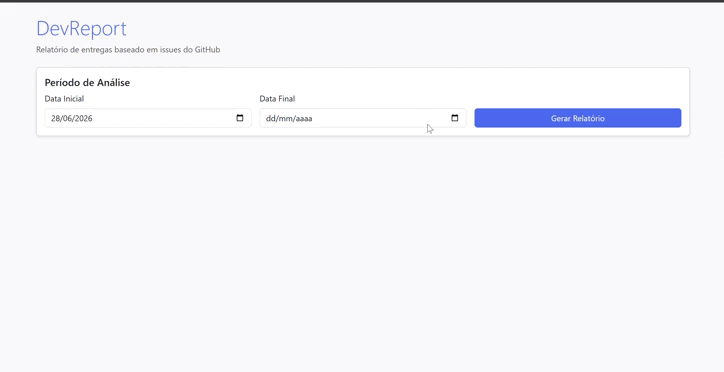

# DevReport

> **Dashboard de Produtividade para Desenvolvedores — Análise inteligente de Issues e Pull Requests do GitHub**

[](https://adoptium.net/)
[](https://spring.io/projects/spring-boot)
[](LICENSE)

---

## 📖 Sobre

O **DevReport** transforma dados de tarefas concluídas no GitHub em indicadores de desempenho profissional. A aplicação consulta automaticamente Issues fechadas e Pull Requests merged, calcula métricas de produtividade, gera um resumo executivo com Inteligência Artificial e apresenta tudo em um dashboard web interativo — com exportação para PDF.

**Objetivo:** apoiar avaliações de desempenho, reuniões 1:1, feedbacks e planejamento de carreira com dados objetivos.

---

## 📸 Demonstração



> *Dashboard interativo do DevReport exibindo métricas de produtividade, gráficos de entregas e resumo inteligente gerado por IA.*

---

## 🏗️ Arquitetura

O projeto segue **Clean Architecture** com separação clara de responsabilidades:

```
┌─────────────────────────────────────────────┐
│  Presentation  →  Controller + Thymeleaf    │
├─────────────────────────────────────────────┤
│  Application   →  Orquestração via Agent    │
├─────────────────────────────────────────────┤
│  Domain        →  Modelos e regras de negócio│
├─────────────────────────────────────────────┤
│  Infrastructure → GitHub API, Spring AI     │
└─────────────────────────────────────────────┘
```

### Estrutura de Pacotes

```
src/main/java/com/devreport/
├── agent/          → Nodes do fluxo de orquestração
├── ai/             → Serviço de IA (InsightService + IssueSelector)
├── config/         → Configurações (GitHubProperties)
├── controller/     → Controllers MVC + DTOs
├── dashboard/      → Montagem do relatório + exportação PDF
├── domain/         → Modelos de domínio (sem dependência do Spring)
├── infrastructure/ │
│   └── github/     → Cliente HTTP, serviços, mappers e filtros
├── metrics/        → Cálculo de métricas e classificação
└── shared/         → Utilitários (validação de período)
```

---

## ⚙️ Stack Tecnológica

| Camada | Tecnologia |
|--------|-----------|
| Linguagem | Java 21 |
| Framework | Spring Boot 3.3 |
| Frontend | Thymeleaf + Bootstrap 5 + Chart.js |
| IA | Spring AI + DeepSeek (OpenAI-compatible) |
| Orquestração | LangGraph4j (agent-based workflow) |
| PDF | openhtmltopdf (HTML → PDF via Thymeleaf) |
| Build | Maven |
| Testes | JUnit 5 + Mockito + Spring Boot Test |

---

## 🤖 Fluxo do Agente (LangGraph4j)

O **DevReportAgent** (`@Service`) monta um **StateGraph** com 6 nodes — cada um é um `@Component` Spring que implementa `NodeAction<AnalysisState>`. O estado compartilhado (`AnalysisState`) trafega entre os nós, e cada nó retorna um `Map<String, Object>` apenas com os campos que quer atualizar.

### Construção do Grafo

```java
var graph = new StateGraph<>(AnalysisState.SCHEMA, AnalysisState::new)
    .addNode("start",              node_async(startNode))
    .addNode("validate",           node_async(validateRequestNode))
    .addNode("fetchGitHubData",    node_async(fetchGitHubDataNode))
    .addNode("calculateMetrics",   node_async(calculateMetricsNode))
    .addNode("generateInsights",   node_async(generateInsightsNode))
    .addNode("buildDashboard",     node_async(buildDashboardNode))
    .addEdge(START, "start")
    .addEdge("start", "validate")
    .addConditionalEdges("validate",         edge_async(errorRouter), validateRoutes)
    .addEdge("fetchGitHubData", "calculateMetrics")
    .addConditionalEdges("calculateMetrics", edge_async(errorRouter), calcMetricsRoutes)
    .addEdge("generateInsights", "buildDashboard")
    .addEdge("buildDashboard", END)
    .compile();
```

O grafo é compilado UMA vez no construtor. A cada requisição, `agent.analyze(request)` injeta o request no `StartNode` via setter e dispara `compiledGraph.invoke(Map.of())`.

### Roteamento Condicional

Dois pontos usam `errorRouter`: se o estado tem erros (`state.hasErrors()`), o fluxo pula direto para `buildDashboard`:

```
START → start → validate ──┬── errors ──► buildDashboard → END
                            └── ok ──────► fetchGitHubData → calculateMetrics
                                                 ──┬── errors ──► buildDashboard → END
                                                   └── ok ──────► generateInsights → buildDashboard → END
```

### Distribuição dos Nodes

| # | Node | Responsabilidade | Serviços injetados | Falha |
|---|------|-----------------|-------------------|-------|
| 1 | `StartNode` | Inicializa o estado com `startDate`, `endDate`, `repositories` | Nenhum (usa `setRequest()`) | — |
| 2 | `ValidateRequestNode` | Valida datas (não-nulas, `endDate ≥ startDate`) | Nenhum | **Crítica**: define `ERRORS` → desvia para dashboard |
| 3 | `FetchGitHubDataNode` | Consulta GitHub API: issues + PRs, filtra por período | `GitHubIssueService`, `GitHubPRService`, mappers, `IssueFilter` | Issues: **crítica**; PRs: **não-bloqueante** (lista vazia) |
| 4 | `CalculateMetricsNode` | Calcula métricas, gráficos e sumários por repositório | `MetricsService`, `PRMetricsService`, `ChartDataService` | — (determinístico) |
| 5 | `GenerateInsightsNode` | Gera resumo executivo com IA (DeepSeek/OpenAI) | `InsightService` | **Não-bloqueante**: dashboard sem resumo de IA |
| 6 | `BuildDashboardNode` | Consolida tudo no `DashboardReport` final | `DashboardService` | Define mensagem padrão se sem entregas |

### Schema do Estado (`AnalysisState`)

Os 16 canais usam dois tipos de reducer: **overwrite** (valores únicos como métricas, gráficos, dashboard) e **appender** (listas como `issues`, `pullRequests`, `errors`, `repositories`). O merge é automático — cada nó só se preocupa com os campos que produz.

---

## 🚀 Como Executar

### Pré-requisitos
- **Java 21**
- **Maven 3.9+**
- Token GitHub (Personal Access Token) com escopos `repo` e `read:org`

### Variáveis de Ambiente

| Variável | Obrigatória | Padrão | Descrição |
|----------|:----------:|--------|-----------|
| `GITHUB_TOKEN` | Sim* | — | Personal Access Token do GitHub |
| `GITHUB_OWNER` | Não | `IA-para-DEVs-SCTEC-T2` | Owner (usuário ou organização) |
| `GITHUB_REPO` | Não | `mini-projeto-modulo2-devreport` | Repositório padrão |
| `GITHUB_PROJECT` | Não | `58` | Número do GitHub Project |
| `GITHUB_ASSIGNEE` | Não | `thiagocaandrade` | Filtro de assignee |
| `AI_API_KEY` | Sim* | — | Chave da API DeepSeek/OpenAI |
| `AI_BASE_URL` | Não | `https://api.deepseek.com` | URL base da API de IA |
| `AI_MODEL` | Não | `deepseek-chat` | Modelo de LLM |
| `AI_TEMPERATURE` | Não | `0.7` | Temperatura do modelo |
| `MOCK_MODE` | Não | `true` | Modo mock (dispensa tokens reais) |

> \* Não obrigatório quando `MOCK_MODE=true`

### Executando com Maven

```bash
# Modo mock (não precisa de tokens)
.\mvnw.cmd spring-boot:run

# Modo real (requer tokens configurados)
$env:MOCK_MODE="false"
$env:GITHUB_TOKEN="ghp_..."
$env:AI_API_KEY="sk-..."
.\mvnw.cmd spring-boot:run
```

Acesse: **http://localhost:8080**

### Build e Testes

```bash
# Compilar
.\mvnw.cmd compile

# Rodar testes (62 testes)
.\mvnw.cmd test

# Gerar JAR
.\mvnw.cmd package -DskipTests
```

---

## 📊 O que o Dashboard Exibe

### Seção Issues
- **Cards:** Total de Entregas, Features, Bugs, Tasks
- **Quick Wins:** Throughput Semanal, Velocidade Média de Resolução, Densidade de Bugs
- **Gráficos:** Entregas por Período, Distribuição por Categoria

### Resumo Inteligente (IA)
- Resumo executivo gerado por IA com contexto de issues, PRs e repositórios
- Destaca repositório com maior contribuição
- Estruturado em seções: destaques, métricas e valor entregue

### Exportação PDF
- Botão "Baixar Relatório PDF" no dashboard
- Gera PDF formatado com todos os dados via `PdfService` (openhtmltopdf)

---

## 🧪 Testes

O projeto possui **62 testes** organizados por camada:

| Categoria | Testes | Descrição |
|-----------|:------:|-----------|
| `MetricsServiceTest` | 12 | Cálculo de métricas de issues |
| `PRMetricsServiceTest` | 8 | Cálculo de métricas de PR |
| `IssueClassifierTest` | 5 | Classificação por labels |
| `GitHubIssueMapperTest` | 5 | Mapeamento JSON → domínio |
| `IssueFilterTest` | 5 | Filtro por período |
| `InsightServiceTest` | 12 | Geração de insights (mock + fallback) |
| `DashboardServiceTest` | 4 | Montagem do DashboardReport |
| `MultiRepoResilienceTest` | 4 | Resiliência multi-repo |
| `FullFlowIntegrationTest` | 5 | Fluxo completo de integração |
| `ApplicationTests` | 1 | Contexto Spring Boot |

```bash
.\mvnw.cmd test
```

---

## 📁 Documentação

A documentação completa do projeto está na pasta `docs/`:

| Documento | Conteúdo |
|-----------|----------|
| `00-project-brief.md` | Visão geral, problema, objetivos e escopo do MVP |
| `01-product-requirements-document.md` | Requisitos funcionais e não funcionais |
| `02-technical-design-document.md` | Arquitetura técnica, camadas, modelos e fluxos |
| `03-product-backlog.md` | Épicos e Product Backlog Items |
| `04-features.md` | Features agrupadas com rastreabilidade |
| `05-specifications.md` | Specifications detalhadas de cada feature |
| `06-tasks.md` | Tasks executáveis com dependências |
| `07-engineering-validation-harness.md` | Protocolo de validação pós-implementação |
| `08-task-validation-matrix.md` | Matriz de checks por task |

---

## 📝 Licença

MIT — Thiago Carlos Andrade, 2026.
