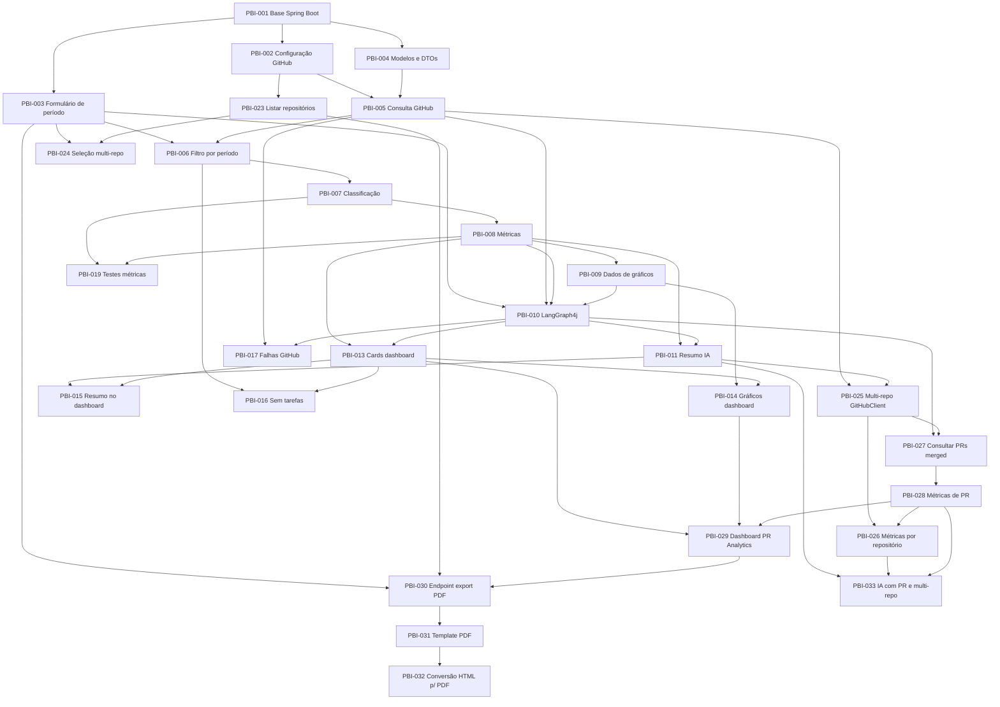

# Product Backlog

# DevReport

Versão: 1.0

Data: Julho/2026

Autor: Thiago Carlos Andrade

---

## 1. Objetivo do Backlog

Este Product Backlog organiza as funcionalidades do DevReport a partir do Project Brief, PRD e TDD.

O objetivo é orientar a construção do MVP, priorizando as entregas que demonstram:

- integração com GitHub Projects;
- cálculo automático de métricas;
- uso de Inteligência Artificial Generativa;
- orquestração com LangGraph4j;
- dashboard web simples e responsivo.

---

## 2. Critério de Priorização

| Prioridade | Significado |
|---|---|
| P0 | Essencial para o MVP funcionar de ponta a ponta |
| P1 | Importante para completar a experiência principal do MVP |
| P2 | Melhoria desejável, mas não bloqueia a demonstração do MVP |
| Futuro | Fora do escopo da primeira entrega |

---

## 3. Épicos do Produto

| Épico | Descrição | Prioridade |
|---|---|---|---|
| EP01 - Configuração e Base Arquitetural | Estruturar o projeto com Spring Boot, camadas e configurações iniciais | P0 |
| EP02 - Entrada de Análise | Permitir que o usuário informe o período de análise | P0 |
| EP03 - Integração GitHub | Consultar tarefas concluídas e PRs no GitHub | P0 |
| EP04 - Motor de Métricas | Calcular indicadores de produtividade a partir de issues e PRs | P0 |
| EP05 - Orquestração com LangGraph4j | Coordenar o fluxo completo da análise usando agente | P0 |
| EP06 - Insights com IA | Gerar resumo executivo e insights com Spring AI/OpenAI | P1 |
| EP07 - Dashboard Web | Exibir indicadores, gráficos, PR Analytics e resumo inteligente | P0 |
| EP08 - Tratamento de Erros | Garantir respostas amigáveis para falhas de GitHub, IA e ausência de dados | P1 |
| EP09 - Testes e Qualidade | Validar regras de negócio, integrações e fluxo principal | P1 |
| EP10 - Multi-Repo Support | Permitir seleção de múltiplos repositórios para análise consolidada | P0 |
| EP11 - PR Analytics | Coletar e exibir métricas de Pull Requests merged | P1 |
| EP12 - Exportação PDF | Gerar relatório formatado em PDF para download | P1 |
| EP13 - Evoluções Futuras | Funcionalidades planejadas para versões posteriores | Futuro |

---

## 4. Product Backlog Items

### PBI-001 - Criar base do projeto Spring Boot

**Prioridade:** P0

**Épico:** EP01 - Configuração e Base Arquitetural

**User Story:** Como desenvolvedor, quero uma base de projeto Spring Boot organizada por camadas para implementar o DevReport seguindo Clean Architecture.

**Descrição:** Configurar o projeto com Java 21, Spring Boot 3.x, Maven e pacotes principais: `config`, `controller`, `application`, `domain`, `infrastructure`, `github`, `metrics`, `dashboard`, `ai`, `agent` e `shared`.

**Critérios de aceite:**

- O projeto deve compilar com Maven.
- A estrutura de pacotes deve refletir as camadas Presentation, Application, Domain e Infrastructure.
- As dependências principais devem incluir Thymeleaf, Spring AI, LangGraph4j e bibliotecas necessárias para integração HTTP.
- A camada de domínio não deve depender de Spring.

**Dependências:** Nenhuma.

---

### PBI-002 - Configurar credenciais e parâmetros do GitHub

**Prioridade:** P0

**Épico:** EP03 - Integração GitHub

**User Story:** Como usuário, quero configurar o token e os dados do repositório/projeto para que o sistema consiga consultar minhas entregas no GitHub.

**Descrição:** Definir propriedades em `application.yml` para Personal Access Token, owner, repository e identificadores necessários para consulta ao GitHub Projects/Issues.

**Critérios de aceite:**

- O token deve ser lido por configuração.
- Os dados do repositório/projeto devem ser centralizados em configuração.
- A aplicação não deve exigir login de usuário.
- A configuração deve estar preparada para execução local do MVP.

**Dependências:** PBI-001.

---

### PBI-003 - Implementar formulário de período da análise

**Prioridade:** P0

**Épico:** EP02 - Entrada de Análise

**User Story:** Como desenvolvedor, quero informar uma data inicial e final para consultar minhas entregas concluídas em um período específico.

**Descrição:** Criar tela inicial ou seção no dashboard com campos `startDate` e `endDate`, enviando a solicitação para o backend.

**Critérios de aceite:**

- O usuário deve conseguir informar data inicial e data final.
- O sistema deve validar período obrigatório.
- O sistema deve impedir data final anterior à data inicial.
- Datas válidas devem iniciar o fluxo de análise.

**Dependências:** PBI-001.

---

### PBI-004 - Modelar entidades e DTOs principais

**Prioridade:** P0

**Épico:** EP01 - Configuração e Base Arquitetural

**User Story:** Como desenvolvedor, quero modelos de domínio e DTOs claros para representar solicitações, issues, métricas, insights e relatórios.

**Descrição:** Criar modelos `AnalysisRequest`, `Issue`, `Metric`, `DashboardReport`, `Insight` e DTOs correspondentes para entrada e saída das camadas.

**Critérios de aceite:**

- `AnalysisRequest` deve representar `startDate` e `endDate`.
- `Issue` deve representar id, título, descrição, labels, data de conclusão e autor.
- `Metric` deve representar total, features, bugs e tasks.
- `DashboardReport` deve consolidar métricas, dados de gráficos e resumo.
- Os DTOs devem isolar a camada de apresentação das regras de negócio.

**Dependências:** PBI-001.

---

### PBI-005 - Consultar issues concluídas no GitHub

**Prioridade:** P0

**Épico:** EP03 - Integração GitHub

**User Story:** Como desenvolvedor, quero que o sistema consulte automaticamente minhas issues concluídas no GitHub para evitar levantamento manual.

**Descrição:** Implementar `GitHubService` ou adapter equivalente para buscar issues concluídas no repositório/projeto configurado.

**Critérios de aceite:**

- O sistema deve consultar o GitHub usando Personal Access Token.
- Apenas tarefas concluídas devem ser consideradas.
- As informações mínimas de cada issue devem incluir título, descrição, labels, data de conclusão e responsável quando disponíveis.
- A integração não deve conter regra de negócio de métricas.
- Falhas de comunicação devem ser propagadas de forma tratável pela aplicação.

**Dependências:** PBI-002, PBI-004.

---

### PBI-006 - Filtrar entregas pelo período informado

**Prioridade:** P0

**Épico:** EP03 - Integração GitHub

**User Story:** Como usuário, quero que apenas entregas concluídas dentro do período informado sejam analisadas para obter um relatório fiel ao intervalo escolhido.

**Descrição:** Aplicar filtro por `closedAt` considerando data inicial e final informadas na solicitação.

**Critérios de aceite:**

- Issues fora do período não devem entrar no cálculo.
- Issues sem data de conclusão não devem ser consideradas como entrega concluída.
- O filtro deve respeitar as regras RN01 e RN02 do PRD.

**Dependências:** PBI-003, PBI-005.

---

### PBI-007 - Classificar entregas por categoria

**Prioridade:** P0

**Épico:** EP04 - Motor de Métricas

**User Story:** Como desenvolvedor, quero que cada entrega seja classificada como Feature, Bug ou Task para entender a composição do meu trabalho.

**Descrição:** Implementar regra de classificação por labels ou convenção configurada, garantindo que cada issue pertença a apenas uma categoria.

**Critérios de aceite:**

- Cada issue analisada deve pertencer a apenas uma categoria.
- As categorias mínimas devem ser Feature, Bug e Task.
- Issues sem label reconhecida devem ter tratamento padrão documentado, preferencialmente como Task.
- A classificação deve ficar no domínio ou serviço de métricas, não na integração GitHub.

**Dependências:** PBI-006.

---

### PBI-008 - Calcular métricas consolidadas

**Prioridade:** P0

**Épico:** EP04 - Motor de Métricas

**User Story:** Como desenvolvedor, quero visualizar a quantidade total de entregas e a quantidade por categoria para demonstrar minha produtividade.

**Descrição:** Implementar `MetricsService` para calcular total de entregas, features, bugs e tasks.

**Critérios de aceite:**

- O total de entregas deve refletir a quantidade de issues filtradas.
- A soma de features, bugs e tasks deve ser igual ao total de entregas.
- O cálculo deve ocorrer antes da geração do resumo por IA.
- O serviço deve possuir testes unitários.

**Dependências:** PBI-007.

---

### PBI-009 - Calcular dados para gráficos

**Prioridade:** P0

**Épico:** EP04 - Motor de Métricas

**User Story:** Como gestor, quero visualizar gráficos de entregas por período e distribuição por categoria para compreender rapidamente o desempenho analisado.

**Descrição:** Gerar estruturas de dados para gráfico de entregas por período e gráfico de distribuição por categoria.

**Critérios de aceite:**

- O sistema deve gerar dados para gráfico de entregas por período.
- O sistema deve gerar dados para gráfico de distribuição por categoria.
- Os dados devem ser compatíveis com consumo pelo Chart.js.
- Cenários sem entregas devem retornar dados vazios de forma controlada.

**Dependências:** PBI-008.

---

### PBI-010 - Implementar fluxo do agente com LangGraph4j

**Prioridade:** P0

**Épico:** EP05 - Orquestração com LangGraph4j

**User Story:** Como desenvolvedor do projeto, quero que a execução da análise seja coordenada por LangGraph4j para demonstrar uma arquitetura moderna e extensível.

**Descrição:** Implementar fluxo com nodes: `StartNode`, `ValidateRequestNode`, `FetchGitHubDataNode`, `CalculateMetricsNode`, `GenerateInsightsNode` e `BuildDashboardNode`.

**Critérios de aceite:**

- O fluxo deve receber uma solicitação de análise.
- O estado compartilhado deve conter datas, issues, métricas, resumo e dashboard.
- A sequência deve validar entrada, buscar dados, calcular métricas, gerar insights e montar dashboard.
- O fluxo deve permitir que erro na IA não interrompa a exibição das métricas.

**Dependências:** PBI-003, PBI-005, PBI-008, PBI-009.

---

### PBI-011 - Gerar resumo executivo com IA

**Prioridade:** P1

**Épico:** EP06 - Insights com IA

**User Story:** Como desenvolvedor, quero receber um resumo executivo gerado por IA para usar em feedbacks, 1:1s e avaliações de desempenho.

**Descrição:** Implementar `InsightService` usando Spring AI e OpenAI GPT para gerar resumo a partir das métricas e das principais issues.

**Critérios de aceite:**

- O prompt deve considerar total de entregas, categorias e principais itens concluídos.
- O resultado deve ser um texto objetivo em formato de resumo executivo.
- A IA deve ser executada somente depois do cálculo das métricas.
- Falha na IA não deve impedir a apresentação do dashboard.

**Dependências:** PBI-008, PBI-010.

---

### PBI-012 - Identificar principais entregas para o resumo

**Prioridade:** P1

**Épico:** EP06 - Insights com IA

**User Story:** Como gestor, quero que o resumo destaque as principais entregas para entender rapidamente os resultados do período.

**Descrição:** Selecionar um conjunto representativo de issues para alimentar o prompt de IA, priorizando título, descrição e categoria.

**Critérios de aceite:**

- O sistema deve enviar para a IA dados suficientes para contextualizar o resumo.
- A seleção deve evitar prompts excessivamente grandes.
- O resumo deve poder mencionar entregas relevantes quando os dados estiverem disponíveis.

**Dependências:** PBI-011.

---

### PBI-013 - Construir dashboard com cards de indicadores

**Prioridade:** P0

**Épico:** EP07 - Dashboard Web

**User Story:** Como usuário, quero visualizar cards com os principais indicadores para entender rapidamente minhas entregas no período.

**Descrição:** Criar view Thymeleaf responsiva com cards para Total de Entregas, Features, Bugs e Tasks.

**Critérios de aceite:**

- O dashboard deve exibir card de Total de Entregas.
- O dashboard deve exibir card de Features.
- O dashboard deve exibir card de Bugs.
- O dashboard deve exibir card de Tasks.
- A interface deve ser responsiva com Bootstrap 5.

**Dependências:** PBI-008, PBI-010.

---

### PBI-014 - Exibir gráficos no dashboard

**Prioridade:** P0

**Épico:** EP07 - Dashboard Web

**User Story:** Como usuário, quero visualizar gráficos para interpretar a distribuição das minhas entregas de forma mais clara.

**Descrição:** Integrar Chart.js na view Thymeleaf para exibir entregas por período e distribuição por categoria.

**Critérios de aceite:**

- O dashboard deve exibir gráfico de entregas por período.
- O dashboard deve exibir gráfico de distribuição por categoria.
- Os gráficos devem usar os dados calculados pelo backend.
- A tela deve continuar legível em desktop e dispositivos móveis.

**Dependências:** PBI-009, PBI-013.

---

### PBI-015 - Exibir resumo inteligente no dashboard

**Prioridade:** P1

**Épico:** EP07 - Dashboard Web

**User Story:** Como usuário, quero visualizar o resumo inteligente junto dos indicadores para ter uma leitura executiva do período analisado.

**Descrição:** Apresentar o texto gerado pela IA no dashboard, quando disponível.

**Critérios de aceite:**

- O resumo deve aparecer no dashboard quando a IA retornar resultado.
- Quando a IA falhar, o dashboard deve continuar exibindo métricas e gráficos.
- A ausência do resumo deve ser comunicada de forma amigável.

**Dependências:** PBI-011, PBI-013.

---

### PBI-016 - Tratar cenário sem tarefas encontradas

**Prioridade:** P1

**Épico:** EP08 - Tratamento de Erros

**User Story:** Como usuário, quero receber uma mensagem clara quando não houver entregas no período para entender que a consulta funcionou, mas não retornou dados.

**Descrição:** Implementar estado vazio no dashboard para períodos sem issues concluídas.

**Critérios de aceite:**

- O dashboard deve informar que não existem entregas para o período informado.
- Cards e gráficos não devem quebrar quando não houver dados.
- A mensagem deve diferenciar ausência de dados de erro de integração.

**Dependências:** PBI-006, PBI-013.

---

### PBI-017 - Tratar falhas na consulta ao GitHub

**Prioridade:** P1

**Épico:** EP08 - Tratamento de Erros

**User Story:** Como usuário, quero receber uma mensagem amigável quando o GitHub estiver indisponível ou a configuração estiver inválida.

**Descrição:** Implementar tratamento para falhas de autenticação, indisponibilidade ou erro de comunicação com GitHub.

**Critérios de aceite:**

- O sistema deve exibir mensagem amigável quando não conseguir consultar o GitHub.
- A aplicação não deve expor token ou detalhes sensíveis.
- O dashboard deve permanecer acessível mesmo após erro de integração.

**Dependências:** PBI-005, PBI-010.

---

### PBI-018 - Registrar logs do fluxo principal

**Prioridade:** P1

**Épico:** EP09 - Testes e Qualidade

**User Story:** Como desenvolvedor, quero logs dos principais passos da análise para facilitar diagnóstico durante a demonstração e manutenção.

**Descrição:** Registrar início da análise, consulta GitHub, cálculo de métricas, chamada de IA, tempo de processamento e fim da análise.

**Critérios de aceite:**

- Os principais passos do fluxo devem gerar logs.
- Logs não devem expor token do GitHub nem dados sensíveis.
- Erros devem ser registrados com contexto suficiente para diagnóstico.

**Dependências:** PBI-010, PBI-011.

---

### PBI-019 - Criar testes unitários do motor de métricas

**Prioridade:** P1

**Épico:** EP09 - Testes e Qualidade

**User Story:** Como desenvolvedor, quero testes unitários do cálculo de métricas para garantir consistência dos indicadores apresentados.

**Descrição:** Cobrir cenários de totalização, categorização e ausência de entregas.

**Critérios de aceite:**

- Deve haver teste para cálculo de total.
- Deve haver teste para cálculo por categoria.
- Deve haver teste para lista vazia.
- Deve haver teste garantindo que cada issue conte em apenas uma categoria.

**Dependências:** PBI-007, PBI-008.

---

### PBI-020 - Criar testes dos mapeamentos e montagem do dashboard

**Prioridade:** P1

**Épico:** EP09 - Testes e Qualidade

**User Story:** Como desenvolvedor, quero validar mapeamentos e montagem do relatório para reduzir risco de inconsistência entre GitHub, métricas e dashboard.

**Descrição:** Testar `GitHubMapper`, `DashboardService` e transformações para DTOs usados pela view.

**Critérios de aceite:**

- O mapper do GitHub deve converter corretamente dados externos em modelo interno.
- O serviço de dashboard deve consolidar métricas, gráficos e resumo.
- Dados ausentes opcionais devem ser tratados sem quebra.

**Dependências:** PBI-004, PBI-005, PBI-009, PBI-013.

---

### PBI-021 - Criar teste de integração do fluxo principal

**Prioridade:** P2

**Épico:** EP09 - Testes e Qualidade

**User Story:** Como desenvolvedor, quero validar o fluxo principal de análise para garantir que entrada, consulta, métricas, IA e dashboard funcionem em conjunto.

**Descrição:** Implementar teste de integração ou teste de aplicação com dependências externas simuladas.

**Critérios de aceite:**

- Dado um período válido e issues simuladas, o sistema deve retornar dashboard consolidado.
- O teste deve validar que métricas são calculadas antes dos insights.
- O teste deve cobrir falha da IA mantendo métricas disponíveis.

**Dependências:** PBI-010, PBI-011, PBI-013.

---

### PBI-022 - Refinar responsividade e usabilidade do dashboard

**Prioridade:** P2

**Épico:** EP07 - Dashboard Web

**User Story:** Como usuário, quero uma interface simples e responsiva para consultar relatórios com clareza em diferentes tamanhos de tela.

**Descrição:** Ajustar espaçamentos, hierarquia visual, estados vazios, mensagens de erro e disposição de cards/gráficos.

**Critérios de aceite:**

- A interface deve ser utilizável em desktop.
- A interface deve ser utilizável em telas menores.
- Mensagens de erro e estado vazio devem ser fáceis de entender.
- O dashboard deve priorizar indicadores e resumo sem excesso de elementos.

**Dependências:** PBI-013, PBI-014, PBI-015, PBI-016, PBI-017.

---

### PBI-023 - Listar repositórios disponíveis do usuário/org

**Prioridade:** P0

**Épico:** EP10 - Multi-Repo Support

**User Story:** Como usuário, quero ver uma lista dos meus repositórios GitHub disponíveis para selecionar quais serão analisados.

**Descrição:** Criar endpoint e componente no GitHubClient para listar repositórios do usuário ou organização configurada via API REST do GitHub.

**Critérios de aceite:**

- O cliente GitHub consulta repositórios do owner configurado.
- A lista é retornada para popular o formulário.
- A consulta respeita o token configurado.
- Repositórios sem issues ou PRs no período não quebram a análise.

**Dependências:** PBI-002.

---

### PBI-024 - Seleção de múltiplos repositórios no formulário

**Prioridade:** P0

**Épico:** EP10 - Multi-Repo Support

**User Story:** Como usuário, quero selecionar quais repositórios serão incluídos na análise para ver um relatório consolidado de todos eles.

**Descrição:** Adicionar campo multi-select ou checkboxes no formulário do dashboard, populado dinamicamente com os repositórios disponíveis.

**Critérios de aceite:**

- O formulário exibe lista de repositórios disponíveis.
- O usuário pode selecionar um ou mais repositórios.
- A seleção é enviada junto com o período para o backend.
- Se nenhum repo for selecionado, usar o repositório padrão configurado.

**Dependências:** PBI-003, PBI-023.

---

### PBI-025 - Suporte a multi-repo no GitHubClient

**Prioridade:** P0

**Épico:** EP10 - Multi-Repo Support

**User Story:** Como sistema, quero iterar sobre múltiplos repositórios ao buscar issues e PRs para consolidar os dados.

**Descrição:** Modificar GitHubClient e serviços de consulta para aceitar uma lista de repositórios e realizar chamadas para cada um, agregando resultados.

**Critérios de aceite:**

- O cliente aceita uma lista de repositórios.
- Issues e PRs de cada repositório são coletados.
- Cada issue/PR recebe o identificador do repositório de origem.
- Falha em um repositório não impede a coleta dos demais.

**Dependências:** PBI-005, PBI-011, PBI-027.

---

### PBI-026 - Agregação de métricas por repositório

**Prioridade:** P1

**Épico:** EP10 - Multi-Repo Support

**User Story:** Como usuário, quero ver o resumo por repositório para entender a contribuição de cada projeto.

**Descrição:** Calcular `RepositorySummary` para cada repositório com total de issues, PRs e linhas alteradas. Exibir no dashboard.

**Critérios de aceite:**

- Cada repositório tem métricas individuais calculadas.
- O dashboard exibe a lista de repositórios com indicadores.
- O total consolidado reflete a soma de todos os repositórios.

**Dependências:** PBI-008, PBI-025, PBI-028.

---

### PBI-027 - Consultar Pull Requests merged

**Prioridade:** P1

**Épico:** EP11 - PR Analytics

**User Story:** Como usuário, quero que o sistema busque meus Pull Requests merged no período para que meu trabalho de código seja registrado.

**Descrição:** Implementar consulta à GitHub REST API para recuperar PRs merged do usuário no período, incluindo dados de additions, deletions, reviews, tempo até merge e revisores.

**Critérios de aceite:**

- Apenas PRs merged são considerados.
- PRs fora do período não são incluídos.
- Os dados coletados incluem número, título, mergedAt, additions, deletions, files, revisores e comentários.
- A consulta respeita o token configurado.

**Dependências:** PBI-010, PBI-025.

---

### PBI-028 - Calcular métricas de PR

**Prioridade:** P1

**Épico:** EP11 - PR Analytics

**User Story:** Como usuário, quero visualizar métricas de PR como total merged, linhas alteradas, tempo até merge e revisores para demonstrar minha contribuição em code review.

**Descrição:** Implementar `PRMetricsService` para calcular total merged, linhas alteradas, tempo médio até merge, revisores distintos e distribuição por tamanho de PR.

**Critérios de aceite:**

- Total de PRs merged reflete a lista filtrada.
- Linhas alteradas é a soma de additions + deletions.
- Tempo até merge é calculado em horas entre createdAt e mergedAt.
- Revisores distintos são contados com base nos logins de review.
- Distribuição de tamanho segue: pequeno <100, médio 100-500, grande >500 linhas.

**Dependências:** PBI-027.

---

### PBI-029 - Dashboard de PR Analytics

**Prioridade:** P1

**Épico:** EP11 - PR Analytics

**User Story:** Como usuário, quero uma seção no dashboard com cards e gráfico de PRs para visualizar minhas contribuições de código.

**Descrição:** Adicionar seção "PR Analytics" no dashboard com cards de PRs merged, linhas alteradas, tempo até merge, revisores e gráfico de distribuição por tamanho.

**Critérios de aceite:**

- Os cards de PR aparecem no dashboard.
- O gráfico de distribuição por tamanho de PR é renderizado.
- A seção de PR fica visível apenas quando há dados de PR.
- Métricas de PR e issues são exibidas lado a lado.

**Dependências:** PBI-013, PBI-014, PBI-028.

---

### PBI-030 - Endpoint de exportação PDF

**Prioridade:** P1

**Épico:** EP12 - Exportação PDF

**User Story:** Como usuário, quero baixar um relatório PDF do meu dashboard para anexar em avaliações de desempenho.

**Descrição:** Criar endpoint `/dashboard/export` que aceita os mesmos parâmetros do dashboard e retorna um arquivo PDF formatado.

**Critérios de aceite:**

- O endpoint aceita período e repositórios.
- O PDF contém cabeçalho com período e repositórios.
- O PDF contém cards KPI (issues e PRs).
- O PDF contém gráficos renderizados.
- O PDF contém o resumo da IA quando disponível.
- O download do arquivo é disparado no navegador.

**Dependências:** PBI-003, PBI-023, PBI-029.

---

### PBI-031 - Template HTML otimizado para PDF

**Prioridade:** P1

**Épico:** EP12 - Exportação PDF

**User Story:** Como sistema, quero um template HTML específico para impressão com CSS que produza um PDF bem formatado.

**Descrição:** Criar template Thymeleaf específico para exportação, com CSS `@media print`, dimensões A4, gráficos em SVG embutido e layout otimizado para página impressa.

**Critérios de aceite:**

- O template possui CSS `@media print`.
- As dimensões seguem formato A4.
- Os gráficos são inseridos como SVG inline.
- O layout não quebra entre páginas.
- Elementos interativos (botões, formulários) são ocultados.

**Dependências:** PBI-023, PBI-030.

---

### PBI-032 - Conversão HTML para PDF

**Prioridade:** P1

**Épico:** EP12 - Exportação PDF

**User Story:** Como sistema, quero converter o template HTML em PDF usando Flying Saucer para gerar o arquivo final.

**Descrição:** Implementar serviço de conversão que renderiza o template Thymeleaf e converte para PDF utilizando Flying Saucer (ou biblioteca equivalente).

**Critérios de aceite:**

- O HTML é renderizado com Thymeleaf.
- A conversão para PDF ocorre sem erros.
- O PDF resultante é retornado como `application/pdf`.
- O arquivo gerado pode ser aberto em leitores de PDF comuns.
- Caracteres especiais e acentos são preservados.

**Dependências:** PBI-031.

---

### PBI-033 - Integrar PR e multi-repo no resumo da IA

**Prioridade:** P1

**Épico:** EP11 - PR Analytics / EP10 - Multi-Repo Support

**User Story:** Como usuário, quero que o resumo da IA mencione dados de PRs e múltiplos repositórios para ter uma visão completa.

**Descrição:** Atualizar o `InsightService` para incluir métricas de PR e contexto multi-repo no prompt da IA, produzindo resumo como "Você entregou 12 features em 3 repositórios, com destaque para o repo-X, e mergeou 14 PRs...".

**Critérios de aceite:**

- O prompt inclui métricas de PR (merged, linhas, tempo).
- O prompt inclui contexto de quantos repositórios foram analisados.
- O resumo pode destacar o repositório com mais contribuições.
- Falha na IA não impede exibição de métricas de PR.

**Dependências:** PBI-011, PBI-026, PBI-028.

---

## 5. Itens Fora do Escopo do MVP

Os itens abaixo fazem parte do roadmap, mas não devem ser implementados na primeira entrega.

| ID | Item | Motivo |
|---|---|---|---|
| FUT-001 | Autenticação de usuários | MVP será usado por um único usuário sem login |
| FUT-002 | Múltiplos usuários | Exige modelo de contas, permissões e isolamento de dados |
| FUT-003 | Persistência em banco de dados | MVP não terá histórico de análises |
| FUT-004 | Comparação entre desenvolvedores | Fora do objetivo inicial e pode gerar implicações de avaliação |
| FUT-005 | Comparação entre períodos | Útil, mas não necessária para o relatório inicial |
| FUT-006 | Integração Jira | Roadmap futuro |
| FUT-007 | Integração Azure DevOps | Roadmap futuro |
| FUT-008 | Integração GitLab | Roadmap futuro |
| FUT-009 | Métricas DORA | Métricas avançadas fora do MVP |
| FUT-010 | Notificações | Não contribui diretamente para a demonstração principal |
| FUT-011 | Dashboard executivo avançado | Depende de histórico, múltiplos projetos ou comparativos |

---

## 6. Sequenciamento Sugerido

---

## 7. Recorte Recomendado

### Fundação

- PBI-001 a PBI-006
- PBI-023 - Listar repositórios disponíveis

### Métricas, Agente e Dashboard Principal

- PBI-007 a PBI-010
- PBI-013 a PBI-014
- PBI-024 - Seleção multi-repo no formulário
- PBI-025 - Multi-repo no GitHubClient

### PR Analytics e Exportação

- PBI-027 - Consultar PRs merged
- PBI-028 - Calcular métricas de PR
- PBI-029 - Dashboard PR Analytics
- PBI-011 - Resumo IA
- PBI-015 - Resumo no dashboard
- PBI-033 - IA com PR e multi-repo
- PBI-030 a PBI-032 - Exportação PDF

### Resiliência e Validação

- PBI-016 a PBI-020
- PBI-026 - Métricas por repositório

---

## 8. Definition of Done

O projeto será considerado concluído quando:

- o usuário conseguir informar um período e selecionar repositórios;
- o sistema consultar issues e PRs nos repositórios selecionados;
- o sistema filtrar entregas pelo período informado;
- o sistema calcular métricas de issues e PRs;
- o dashboard exibir cards, gráficos e PR Analytics;
- o sistema gerar um resumo executivo com IA considerando multi-repo e PRs;
- o relatório puder ser exportado em PDF;
- falhas na IA não impedirem a exibição das métricas;
- falhas no GitHub e ausência de dados gerarem mensagens amigáveis;
- o fluxo principal estiver orquestrado com LangGraph4j;
- os principais cálculos possuírem testes unitários.

