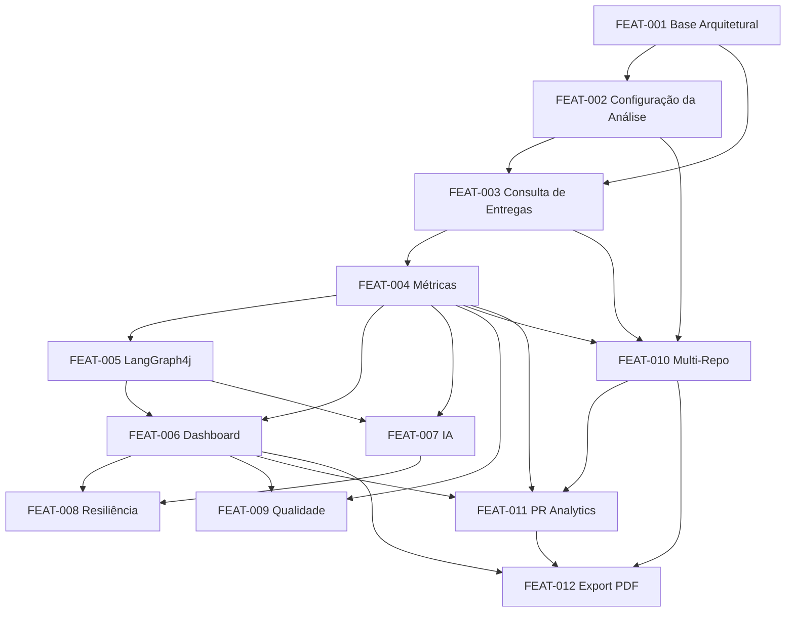

# Features

# DevReport

Versão: 1.0

Data: Julho/2026

Autor: Thiago Carlos Andrade

---

## 1. Objetivo

Este documento consolida as Features do DevReport a partir do Project Brief, PRD, TDD e Product Backlog.

As Features representam capacidades de produto em nível funcional, agrupando PBIs relacionados e mantendo rastreabilidade com os requisitos do MVP.

---

## 2. Visão Geral das Features

| ID | Feature | Prioridade | Status | PBIs relacionados |
|---|---|---|---|---|---|
| FEAT-001 | Base Arquitetural do MVP | P0 | Implementada | PBI-001, PBI-004 |
| FEAT-002 | Configuração da Análise GitHub | P0 | Implementada | PBI-002, PBI-003 |
| FEAT-003 | Consulta de Entregas Concluídas | P0 | Implementada | PBI-005, PBI-006 |
| FEAT-004 | Classificação e Cálculo de Métricas | P0 | Implementada | PBI-007, PBI-008, PBI-009 |
| FEAT-005 | Orquestração do Fluxo com LangGraph4j | P0 | Implementada | PBI-010 |
| FEAT-006 | Dashboard Web Consolidado | P0 | Implementada | PBI-013, PBI-014, PBI-015, PBI-022 |
| FEAT-007 | Resumo Executivo com IA | P1 | Implementada | PBI-011, PBI-012, PBI-015 |
| FEAT-008 | Resiliência, Estados Alternativos e Observabilidade | P1 | Implementada | PBI-016, PBI-017, PBI-018 |
| FEAT-009 | Qualidade e Validação do MVP | P1 | Implementada | PBI-019, PBI-020, PBI-021 |
| FEAT-010 | Multi-Repo Support | P0 | Implementada | PBI-023, PBI-024, PBI-025, PBI-026 |
| FEAT-011 | PR Analytics | P1 | Implementada | PBI-027, PBI-028, PBI-029, PBI-033 |
| FEAT-012 | Exportação PDF | P1 | Implementada | PBI-030, PBI-031, PBI-032 |
| FEAT-013 | Evoluções Futuras | Futuro | Fora do MVP | FUT-001 a FUT-011 |

---

## 3. Features do MVP

### FEAT-001 - Base Arquitetural do MVP

**Prioridade:** P0

**Objetivo:** Disponibilizar uma base técnica organizada para construir o DevReport com separação clara entre apresentação, aplicação, domínio e infraestrutura.

**Valor para o produto:** Reduz acoplamento, facilita evolução futura e garante que as regras de negócio não fiquem misturadas com integrações externas ou interface.

**Escopo:**

- Projeto Spring Boot com Java 21 e Maven.
- Estrutura de pacotes alinhada ao TDD.
- Modelos de domínio principais.
- DTOs de entrada e saída.
- Separação entre camadas Presentation, Application, Domain e Infrastructure.

**Fora do escopo:**

- Banco de dados.
- Autenticação.
- Histórico de análises.
- Múltiplos usuários.

**Requisitos relacionados:**

- RNF03 - Código organizado utilizando boas práticas.
- RNF04 - Arquitetura preparada para evolução.
- RNF05 - Separação clara entre regras de negócio e infraestrutura.

**Critérios de aceite:**

- O projeto deve compilar.
- A camada de domínio não deve depender de Spring.
- Os modelos `AnalysisRequest`, `Issue`, `Metric`, `DashboardReport` e `Insight` devem existir.
- Os DTOs devem isolar a view e os controllers dos modelos externos.

**PBIs relacionados:** PBI-001, PBI-004.

---

### FEAT-002 - Configuração da Análise GitHub

**Prioridade:** P0

**Objetivo:** Permitir que o MVP seja executado localmente com um repositório/projeto GitHub previamente configurado e um período informado pelo usuário.

**Valor para o produto:** Dá ao usuário controle sobre o intervalo analisado e permite que a aplicação consulte a fonte real de dados sem exigir login ou cadastro.

**Escopo:**

- Configuração de Personal Access Token.
- Configuração de owner, repository e identificadores necessários.
- Formulário web com data inicial e data final.
- Validação básica do período informado.

**Fora do escopo:**

- Login OAuth com GitHub.
- Tela administrativa de configuração.

**Requisitos relacionados:**

- RF01 - Permitir informar um período inicial e final.
- RN02 - Somente tarefas pertencentes ao período informado deverão ser analisadas.

**Critérios de aceite:**

- O usuário deve conseguir informar data inicial e data final.
- O sistema deve rejeitar período inválido.
- O token e os dados do GitHub devem ser lidos por configuração.
- A aplicação deve funcionar sem autenticação de usuário.

**PBIs relacionados:** PBI-002, PBI-003.

---

### FEAT-003 - Consulta de Entregas Concluídas

**Prioridade:** P0

**Objetivo:** Recuperar automaticamente issues concluídas e PRs merged no GitHub e filtrar apenas as entregas pertencentes ao período solicitado.

**Valor para o produto:** Elimina levantamento manual e transforma dados operacionais do GitHub em insumo estruturado para métricas e dashboard.

**Escopo:**

- Consulta ao GitHub REST API.
- Recuperação de issues concluídas.
- Recuperação de Pull Requests merged.
- Coleta de título, descrição, labels, data de conclusão, PR data (additions, deletions, files, revisores) quando disponíveis.
- Filtro por `closedAt`/`mergedAt`.
- Conversão dos dados externos para modelo interno.
- Suporte a iteração sobre múltiplos repositórios.

**Fora do escopo:**

- Integração Jira.
- Integração Azure DevOps.
- Integração GitLab.
- Consulta de tarefas abertas.

**Requisitos relacionados:**

- RF02 - Consultar tarefas concluídas no GitHub.
- RF03 - Recuperar informações das Issues.
- RF11 - Consultar Pull Requests merged no período.
- RN01 - Somente tarefas concluídas deverão ser consideradas.
- RN02 - Somente tarefas pertencentes ao período informado deverão ser analisadas.

**Critérios de aceite:**

- Apenas issues concluídas devem ser consideradas.
- Apenas PRs merged devem ser considerados.
- Issues e PRs fora do período informado não devem ser analisados.
- Falhas de comunicação com GitHub devem ser tratáveis pela aplicação.

**PBIs relacionados:** PBI-005, PBI-006, PBI-025, PBI-027.

---

### FEAT-004 - Classificação e Cálculo de Métricas

**Prioridade:** P0

**Objetivo:** Classificar entregas e calcular indicadores consolidados de produtividade para issues e PRs.

**Valor para o produto:** Transforma a lista bruta de issues e PRs em dados objetivos para feedbacks, avaliações de desempenho e acompanhamento profissional.

**Escopo:**

- Classificação de issues em Feature, Bug ou Task.
- Cálculo de total de entregas (issues).
- Cálculo de quantidade por categoria.
- Cálculo de métricas de PR: total merged, linhas alteradas, tempo até merge, revisores, distribuição por tamanho.
- Cálculo de indicadores por repositório (RepositorySummary).
- Geração de dados para gráfico de entregas por período.
- Geração de dados para gráfico de distribuição por categoria.
- Geração de dados para gráfico de distribuição por tamanho de PR.

**Fora do escopo:**

- Métricas DORA.
- Comparação entre desenvolvedores.
- Benchmark de produtividade.
- Métricas históricas persistidas.

**Requisitos relacionados:**

- RF04 - Agrupar entregas por tipo.
- RF05 - Calcular quantidade total de entregas.
- RF06 - Calcular quantidade por categoria.
- RF07 - Apresentar gráficos.
- RF12 - Calcular métricas de PR.
- RF13 - Agregar métricas de múltiplos repositórios.
- RN03 - Cada Issue deverá pertencer apenas a uma categoria.
- RN04 - As métricas deverão ser calculadas antes da geração do resumo por IA.

**Critérios de aceite:**

- Cada issue deve pertencer a apenas uma categoria.
- Issues sem categoria reconhecida devem receber tratamento padrão documentado.
- O total de entregas deve ser consistente com a soma das categorias.
- Métricas de PR refletem os PRs merged do período.
- Os dados de gráficos devem ser consumíveis pelo dashboard.

**PBIs relacionados:** PBI-007, PBI-008, PBI-009, PBI-026, PBI-028.

---

### FEAT-005 - Orquestração do Fluxo com LangGraph4j

**Prioridade:** P0

**Objetivo:** Coordenar o fluxo completo de análise por meio de um agente LangGraph4j.

**Valor para o produto:** Demonstra uso de arquitetura moderna com orquestração explícita do processo, facilitando futuras expansões do agente.

**Escopo:**

- Estado compartilhado da análise.
- Node de início.
- Node de validação da requisição.
- Node de consulta ao GitHub.
- Node de cálculo de métricas.
- Node de geração de insights.
- Node de montagem do dashboard.

**Fora do escopo:**

- Agentes autônomos multiusuário.
- Fluxos complexos de recomendação.
- Memória persistente do agente.

**Requisitos relacionados:**

- Fluxo principal do PRD.
- Arquitetura e fluxo do agente definidos no TDD.
- RN04 - Métricas calculadas antes da IA.
- RN05 - Dashboard continua funcionando caso a IA esteja indisponível.

**Critérios de aceite:**

- O fluxo deve executar validação, consulta, métricas, IA e dashboard na ordem correta.
- O estado deve conter datas, issues, métricas, resumo e dashboard.
- Falha na IA não deve interromper a apresentação das métricas.
- Logs devem permitir acompanhar os principais passos da execução.

**PBIs relacionados:** PBI-010.

---

### FEAT-006 - Dashboard Web Consolidado

**Prioridade:** P0

**Objetivo:** Apresentar o resultado da análise em uma interface web simples, responsiva e orientada a leitura rápida, com seções de issues e PR Analytics.

**Valor para o produto:** Entrega a principal experiência do usuário: visualizar indicadores de issues e PRs, gráficos, resumo por repositório e exportar relatório em PDF.

**Escopo:**

- View Thymeleaf.
- Bootstrap 5 para responsividade.
- Cards de Total de Entregas, Features, Bugs e Tasks (seção Issues).
- Cards de PRs merged, linhas alteradas, tempo até merge, revisores (seção PR Analytics).
- Indicador de repositórios analisados.
- Gráfico de entregas por período.
- Gráfico de distribuição por categoria.
- Gráfico de distribuição por tamanho de PR.
- Área para resumo inteligente com contexto multi-repo.
- Botão "Baixar Relatório PDF".
- Estado vazio e mensagens amigáveis.

**Fora do escopo:**

- Dashboard executivo avançado.
- Comparação entre períodos.
- Customização visual avançada.

**Requisitos relacionados:**

- RF07 - Apresentar gráficos.
- RF09 - Exibir dashboard consolidado.
- RF13 - Agregar métricas de múltiplos repositórios.
- RNF01 - Interface Web responsiva.
- Dashboard definido no PRD e TDD.

**Critérios de aceite:**

- O dashboard deve exibir todos os cards de issues e PRs.
- Os gráficos devem ser renderizados com dados do backend.
- A interface deve funcionar em desktop e telas menores.
- O dashboard deve permanecer utilizável quando o resumo de IA não estiver disponível.

**PBIs relacionados:** PBI-013, PBI-014, PBI-015, PBI-022, PBI-026, PBI-029.

---

### FEAT-007 - Resumo Executivo com IA

**Prioridade:** P1

**Objetivo:** Gerar um resumo executivo e insights sobre as entregas do período usando Spring AI e OpenAI GPT, incorporando contexto multi-repo e métricas de PR.

**Valor para o produto:** Converte métricas e entregas em uma narrativa útil para reuniões de feedback, 1:1, promoções e planejamento de carreira, com visão completa de issues, PRs e múltiplos projetos.

**Escopo:**

- Serviço de geração de insights.
- Prompt baseado em métricas de issues + PRs + repositórios.
- Seleção controlada de issues e PRs relevantes para o prompt.
- Contexto multi-repo no resumo (ex: "Você entregou 12 features em 3 repositórios").
- Exibição do resumo no dashboard quando disponível.

**Fora do escopo:**

- Recomendações inteligentes avançadas.
- Histórico de insights.
- Personalização de tom do resumo.
- Chat conversacional.

**Requisitos relacionados:**

- RF08 - Gerar resumo inteligente.
- RN04 - As métricas deverão ser calculadas antes da geração do resumo por IA.
- RN05 - Caso a IA esteja indisponível, o dashboard continuará funcionando normalmente.

**Critérios de aceite:**

- O resumo deve ser gerado a partir de métricas calculadas.
- O prompt deve incluir métricas de PR e contexto multi-repo.
- A aplicação deve limitar o volume de dados enviado ao modelo.
- Falha na IA deve omitir o resumo sem quebrar métricas e gráficos.

**PBIs relacionados:** PBI-011, PBI-012, PBI-015, PBI-033.

---

### FEAT-008 - Resiliência, Estados Alternativos e Observabilidade

**Prioridade:** P1

**Objetivo:** Garantir que o DevReport lide bem com falhas externas, ausência de dados e diagnóstico operacional básico.

**Valor para o produto:** Mantém a experiência compreensível mesmo quando GitHub ou IA falham, aumentando confiabilidade na demonstração do MVP.

**Escopo:**

- Estado sem tarefas encontradas.
- Tratamento de falhas de autenticação ou comunicação com GitHub.
- Tratamento de erro na IA.
- Mensagens amigáveis.
- Logs dos principais passos do fluxo.
- Medição básica de tempo de processamento.

**Fora do escopo:**

- Monitoramento em produção.
- Alertas.
- Observabilidade distribuída.
- Painel administrativo de logs.

**Requisitos relacionados:**

- Fluxos alternativos do PRD.
- RNF02 - Tempo médio de carregamento inferior a cinco segundos.
- RN05 - Caso a IA esteja indisponível, o dashboard continuará funcionando normalmente.

**Critérios de aceite:**

- GitHub indisponível deve gerar mensagem amigável.
- Nenhuma tarefa encontrada deve gerar estado vazio claro.
- Erro na IA não deve impedir dashboard com métricas.
- Logs não devem expor token ou dados sensíveis.

**PBIs relacionados:** PBI-016, PBI-017, PBI-018.

---

### FEAT-009 - Qualidade e Validação do MVP

**Prioridade:** P1

**Objetivo:** Validar as principais regras de negócio e fluxos do MVP com testes focados nos pontos de maior risco.

**Valor para o produto:** Reduz risco de indicadores incorretos e aumenta confiança na apresentação do dashboard.

**Escopo:**

- Testes unitários do motor de métricas.
- Testes de classificação por categoria.
- Testes de lista vazia.
- Testes de mapeamento GitHub.
- Testes de montagem do dashboard.
- Teste de integração do fluxo principal com dependências simuladas, se houver tempo.

**Fora do escopo:**

- Cobertura exaustiva.
- Testes end-to-end completos.
- Testes de carga.
- Testes com GitHub real em pipeline.

**Requisitos relacionados:**

- Critérios de aceite de Consulta, Métricas, Dashboard e IA do PRD.
- Seção de Testes do TDD.

**Critérios de aceite:**

- As métricas principais devem possuir testes unitários.
- O mapeamento de dados externos deve ser validado.
- O dashboard report deve ser montado com dados consistentes.
- O cenário de falha da IA deve ser coberto quando houver teste de integração.

**PBIs relacionados:** PBI-019, PBI-020, PBI-021.

---

### FEAT-010 - Multi-Repo Support

**Prioridade:** P0

**Objetivo:** Permitir que o usuário selecione múltiplos repositórios para compor uma análise consolidada no dashboard.

**Valor para o produto:** Um desenvolvedor que contribui em vários projetos pode ver todas as entregas em um único relatório, sem precisar rodar o DevReport separadamente para cada repositório.

**Escopo:**

- Listagem de repositórios disponíveis via API do GitHub.
- Campo multi-select no formulário do dashboard.
- Iteração sobre N repositórios no GitHubClient.
- Agregação de issues e PRs com identificação da origem.
- Cálculo de métricas por repositório (RepositorySummary).
- Exibição de indicador "3 repositórios analisados" no dashboard.

**Fora do escopo:**

- Descoberta automática de repositórios por contribuição do usuário.
- Favoritar repositórios.
- Sincronização em tempo real.

**Requisitos relacionados:**

- RF10 - Selecionar múltiplos repositórios.
- RF13 - Agregar métricas de múltiplos repositórios.

**Critérios de aceite:**

- O formulário exibe repositórios disponíveis.
- O usuário pode selecionar um ou mais repositórios.
- Issues e PRs de cada repositório são coletadas e identificadas.
- Falha em um repositório não impede a coleta dos demais.
- O dashboard mostra indicador de repositórios analisados.

**PBIs relacionados:** PBI-023, PBI-024, PBI-025, PBI-026.

---

### FEAT-011 - PR Analytics

**Prioridade:** P1

**Objetivo:** Expandir o DevReport para incluir Pull Requests merged no período, com métricas específicas de code review e contribuição de código.

**Valor para o produto:** Issues fechadas muitas vezes não contam a história completa. PR Analytics dá evidência objetiva do trabalho de código (linhas, revisões, ciclo), que é o que realmente importa em avaliações técnicas.

**Escopo:**

- Consulta de PRs merged do usuário no período.
- Coleta de additions, deletions, changedFiles, revisores, comentários.
- Cálculo de métricas: total merged, linhas alteradas, tempo até merge, revisores distintos, distribuição por tamanho.
- Seção dedicada "PR Analytics" no dashboard com cards e gráfico.
- Incorporação de métricas de PR no resumo da IA.

**Fora do escopo:**

- PRs abertos ou fechados sem merge.
- Métricas de taxa de revisão aprovada/rejeitada.
- Comparação de PRs entre desenvolvedores.

**Requisitos relacionados:**

- RF11 - Consultar Pull Requests merged no período.
- RF12 - Calcular métricas de PR.

**Critérios de aceite:**

- PRs merged são coletados e identificados por repositório.
- Métricas de PR são calculadas corretamente.
- Seção PR Analytics aparece no dashboard quando há dados.
- O resumo de IA inclui contexto de PRs.

**PBIs relacionados:** PBI-027, PBI-028, PBI-029, PBI-033.

---

### FEAT-012 - Exportação PDF

**Prioridade:** P1

**Objetivo:** Gerar um arquivo PDF formatado do relatório, pronto para download, impressão ou anexo em processos de avaliação.

**Valor para o produto:** Torna o DevReport uma ferramenta de performance review de verdade — o dev pode gerar o PDF e anexar diretamente no formulário de avaliação da empresa.

**Escopo:**

- Endpoint `/dashboard/export` com mesmos parâmetros do dashboard.
- Reutilização dos dados computados do DashboardReport.
- Template HTML otimizado para impressão (CSS `@media print`, A4).
- Conversão HTML para PDF via Flying Saucer.
- Conteúdo: cabeçalho, cards KPI, gráficos SVG, resumo IA.

**Fora do escopo:**

- PDF personalizável (seleção de seções).
- Envio por e-mail.
- Agendamento de geração automática.

**Requisitos relacionados:**

- RF14 - Exportar relatório completo em PDF.

**Critérios de aceite:**

- Endpoint retorna `application/pdf`.
- PDF contém cabeçalho, cards, gráficos e resumo.
- PDF pode ser aberto em leitores comuns.
- Gráficos são preservados no PDF.

**PBIs relacionados:** PBI-030, PBI-031, PBI-032.

---

## 4. Feature Fora do MVP

### FEAT-013 - Evoluções Futuras

**Prioridade:** Futuro

**Objetivo:** Registrar capacidades planejadas para versões posteriores sem incluí-las no escopo da primeira entrega.

**Valor para o produto:** Mantém clareza sobre a direção de evolução do DevReport sem comprometer o prazo acadêmico do MVP.

**Escopo futuro:**

- Autenticação de usuários.
- Múltiplos usuários.
- Persistência em banco de dados.
- Histórico de análises.
- Comparação entre períodos.
- Comparação entre desenvolvedores.
- Dashboard executivo avançado.
- Integração Jira.
- Integração Azure DevOps.
- Integração GitLab.
- Métricas DORA.
- Recomendações inteligentes.

**Critério de aceite para planejamento futuro:**

- Nenhuma dessas capacidades deve bloquear ou expandir o escopo do MVP.
- Cada item futuro deverá ter PRD/TDD próprio ou revisão dos documentos existentes antes de implementação.

**Itens relacionados:** FUT-001 a FUT-011.

---

## 5. Mapa de Rastreabilidade

| Requisito | Feature principal | Observações |
|---|---|---|---|
| RF01 - Informar período inicial e final | FEAT-002 | Entrada principal da análise |
| RF02 - Consultar tarefas concluídas no GitHub | FEAT-003 | Usa GitHub REST API |
| RF03 - Recuperar informações das Issues | FEAT-003 | Dados mínimos para métricas e IA |
| RF04 - Agrupar entregas por tipo | FEAT-004 | Feature, Bug e Task |
| RF05 - Calcular total de entregas | FEAT-004 | Métrica central do MVP |
| RF06 - Calcular quantidade por categoria | FEAT-004 | Base dos cards e gráficos |
| RF07 - Apresentar gráficos | FEAT-006 | Usa dados preparados pela FEAT-004 |
| RF08 - Gerar resumo inteligente | FEAT-007 | Depende das métricas |
| RF09 - Exibir dashboard consolidado | FEAT-006 | Principal tela do MVP |
| RF10 - Selecionar múltiplos repositórios | FEAT-010 | Multi-repo support |
| RF11 - Consultar Pull Requests merged | FEAT-011 | PR Analytics |
| RF12 - Calcular métricas de PR | FEAT-004, FEAT-011 | Metrics + PR Analytics |
| RF13 - Agregar métricas multi-repo | FEAT-010 | Consolidação do relatório |
| RF14 - Exportar relatório em PDF | FEAT-012 | Exportação PDF |
| RN01 - Somente tarefas concluídas | FEAT-003 | Regra aplicada na consulta/filtro |
| RN02 - Somente período informado | FEAT-002, FEAT-003 | Entrada e filtro por `closedAt` |
| RN03 - Cada Issue em uma categoria | FEAT-004 | Regra do motor de métricas |
| RN04 - Métricas antes da IA | FEAT-005, FEAT-007 | Ordem garantida no fluxo |
| RN05 - Dashboard funciona sem IA | FEAT-007, FEAT-008 | IA é opcional |

---

## 6. Sequência Recomendada de Implementação

---

## 7. Recorte do MVP Essencial

Para uma demonstração funcional de ponta a ponta, as Features essenciais são:

- FEAT-001 - Base Arquitetural do MVP
- FEAT-002 - Configuração da Análise GitHub
- FEAT-003 - Consulta de Entregas Concluídas (issues + PRs)
- FEAT-004 - Classificação e Cálculo de Métricas (issues + PRs)
- FEAT-005 - Orquestração do Fluxo com LangGraph4j
- FEAT-006 - Dashboard Web Consolidado (com PR Analytics)
- FEAT-007 - Resumo Executivo com IA (com contexto multi-repo e PRs)
- FEAT-008 - Resiliência, Estados Alternativos e Observabilidade
- FEAT-010 - Multi-Repo Support
- FEAT-011 - PR Analytics
- FEAT-012 - Exportação PDF

A FEAT-009 deve acompanhar o desenvolvimento com foco nos cálculos e mapeamentos mais críticos, mas pode ser ajustada conforme a restrição de prazo.

