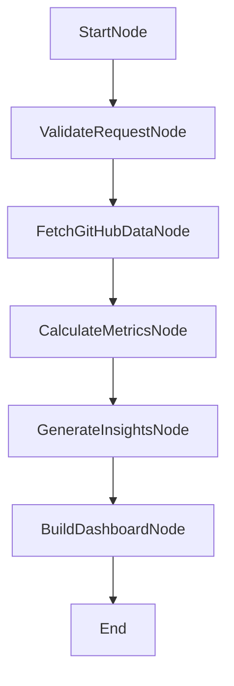
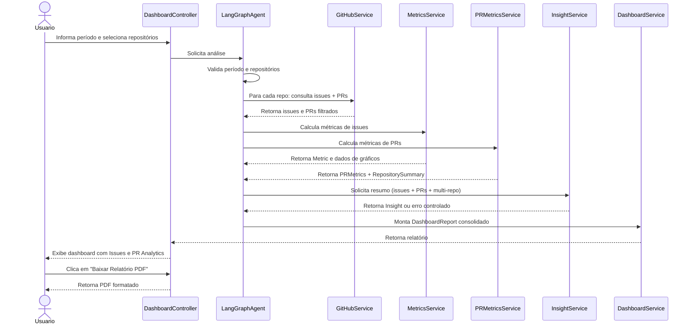

# Specifications

# DevReport

Versão: 1.0

Data: Julho/2026

Autor: Thiago Carlos Andrade

---

## 1. Objetivo

Este documento detalha as Specifications do MVP do DevReport.

As Specifications transformam as Features em comportamento implementável, descrevendo entradas, saídas, regras, validações, fluxos, estados alternativos e critérios de aceite verificáveis.

---

## 2. Escopo das Specifications

Estas especificações cobrem o DevReport:

- aplicação web para um único usuário;
- sem autenticação;
- sem banco de dados;
- consulta a um ou múltiplos repositórios GitHub;
- análise de issues concluídas e PRs merged em um período informado;
- cálculo de métricas de issues e PRs;
- agregação por repositório;
- geração opcional de resumo por IA com contexto multi-repo e PRs;
- dashboard web com cards, gráficos, PR Analytics, indicador de repositórios e exportação PDF.

Não fazem parte destas Specifications:

- múltiplos usuários;
- login ou OAuth;
- persistência de histórico;
- comparação entre colaboradores;
- comparação entre períodos;
- métricas DORA;
- integrações Jira, Azure DevOps ou GitLab.

---

## 3. Convenções

| Campo | Descrição |
|---|---|
| ID | Identificador único da specification |
| Feature | Feature principal relacionada |
| Prioridade | P0, P1 ou P2 |
| Entrada | Dados necessários para executar o comportamento |
| Saída | Resultado esperado |
| Regras | Regras funcionais ou de negócio aplicáveis |
| Critérios de aceite | Condições objetivas para considerar a specification atendida |

---

## 4. Specifications do MVP

### SPEC-001 - Estrutura Base da Aplicação

**Feature:** FEAT-001 - Base Arquitetural do MVP

**Prioridade:** P0

**Objetivo:** Definir a estrutura base do projeto para suportar o fluxo completo do DevReport com separação de responsabilidades.

**Entrada:**

- Projeto Java 21.
- Build Maven.
- Dependências Spring Boot 3.x.

**Saída:**

- Aplicação Spring Boot compilável.
- Pacotes organizados por responsabilidade.
- Modelos e DTOs essenciais disponíveis.

**Estrutura esperada:**

```text
src/main/java/br/com/devreport
  config
  controller
  application
  domain
  infrastructure
  github
  metrics
  dashboard
  ai
  agent
  shared
```

**Modelos de domínio mínimos:**

| Modelo | Responsabilidade | Campos mínimos |
|---|---|---|
| AnalysisRequest | Representar a solicitação de análise | startDate, endDate, repositories |
| Issue | Representar uma entrega recuperada do GitHub | id, title, description, labels, closedAt, author, repository |
| PullRequest | Representar um PR merged do GitHub | id, number, title, createdAt, mergedAt, additions, deletions, changedFiles, reviewers, repository |
| Metric | Representar indicadores calculados de issues | total, features, bugs, tasks |
| PRMetrics | Representar métricas de Pull Requests | totalMerged, totalAdditions, totalDeletions, totalChangedFiles, averageTimeToMerge, uniqueReviewers, prSizeDistribution |
| RepositorySummary | Representar contribuição por repositório | name, totalIssues, totalPRs, totalAdditions |
| DashboardReport | Representar o relatório final | metrics, prMetrics, repositorySummaries, charts, summary, repositoriesCount |
| Insight | Representar o texto gerado por IA | content |

**DTOs mínimos:**

- AnalysisRequestDTO (com lista de repositórios)
- IssueDTO (com repositório de origem)
- PullRequestDTO
- MetricDTO
- PRMetricsDTO
- RepositorySummaryDTO
- DashboardDTO
- InsightDTO

**Regras:**

- A camada de domínio não deve depender de Spring.
- Regras de negócio não devem ficar em controllers.
- Integrações externas devem ficar na camada de infraestrutura.
- DTOs devem ser usados para entrada e saída da camada de apresentação.

**Critérios de aceite:**

- O projeto compila com Maven.
- Os pacotes principais existem.
- Os modelos mínimos estão definidos.
- Controllers não contêm regra de negócio.
- Serviços de infraestrutura não calculam métricas.

**Rastreabilidade:** FEAT-001, PBI-001, PBI-004, RNF03, RNF04, RNF05.

---

### SPEC-002 - Configuração e Entrada da Análise

**Feature:** FEAT-002 - Configuração da Análise GitHub

**Prioridade:** P0

**Objetivo:** Permitir que o usuário informe o período de análise e que a aplicação acesse o GitHub por configuração local.

**Entrada do usuário:**

| Campo | Tipo | Obrigatório | Regra |
|---|---|---|---|
| startDate | date | Sim | Deve ser menor ou igual a endDate |
| endDate | date | Sim | Deve ser maior ou igual a startDate |
| repositories | List<String> | Não | Lista de repositórios selecionados; vazio = usar repositório padrão |

**Configurações da aplicação:**

| Propriedade | Obrigatória | Descrição |
|---|---|---|
| github.token | Sim | Personal Access Token |
| github.owner | Sim | Dono da organização ou usuário |
| github.repository | Não | Repositório padrão (fallback se nenhum for selecionado) |
| github.project | Condicional | Identificador do Project, se necessário |

**Saída:**

- `AnalysisRequest` válida.
- Mensagem de validação quando o período for inválido.
- Execução do fluxo de análise quando a entrada for válida.

**Regras:**

- A aplicação não deve exigir autenticação de usuário.
- O token deve ser lido por configuração.
- O token não deve aparecer em tela, logs ou mensagens de erro.
- Data final anterior à data inicial deve bloquear a análise.

**Fluxo principal:**

1. Usuário acessa o dashboard.
2. Usuário informa data inicial e data final.
3. Sistema valida campos obrigatórios.
4. Sistema valida ordem das datas.
5. Sistema inicia a análise.

**Critérios de aceite:**

- Formulário aceita período válido.
- Formulário rejeita datas ausentes.
- Formulário rejeita data final anterior à inicial.
- Configurações GitHub são carregadas pela aplicação.
- Nenhuma credencial sensível é exibida.

**Rastreabilidade:** FEAT-002, PBI-002, PBI-003, RF01, RN02.

---

### SPEC-003 - Consulta de Entregas no GitHub

**Feature:** FEAT-003 - Consulta de Entregas Concluídas

**Prioridade:** P0

**Objetivo:** Consultar issues concluídas no GitHub e converter os dados para o modelo interno da aplicação.

**Entrada:**

- `AnalysisRequest` válida (incluindo lista de repositórios).
- Configurações GitHub carregadas.
- Personal Access Token válido.

**Saída:**

- Lista de `Issue`.
- Lista de `PullRequest`.
- Lista de repositórios disponíveis (para popular o formulário).
- Lista vazia quando não houver entregas.
- Erro tratável quando o GitHub estiver indisponível ou a configuração for inválida.

**Dados mínimos por issue:**

| Campo | Obrigatório | Origem esperada |
|---|---|---|
| id | Sim | GitHub Issue |
| title | Sim | GitHub Issue |
| description | Não | Body da issue |
| labels | Não | Labels da issue |
| closedAt | Sim | Data de fechamento |
| author | Não | Autor ou responsável disponível |
| repository | Sim | Identificador do repositório de origem (owner/repo) |

**Dados mínimos por PullRequest:**

| Campo | Obrigatório | Origem esperada |
|---|---|---|
| id | Sim | GitHub PR |
| number | Sim | Número do PR |
| title | Sim | Título do PR |
| createdAt | Sim | Data de criação |
| mergedAt | Sim | Data de merge |
| additions | Sim | Linhas adicionadas |
| deletions | Sim | Linhas removidas |
| changedFiles | Sim | Arquivos modificados |
| reviewers | Não | Lista de logins de revisores |
| reviewComments | Não | Total de comentários de review |
| labels | Não | Labels do PR |
| repository | Sim | Identificador do repositório de origem (owner/repo) |

**Regras:**

- O cliente deve aceitar uma lista de repositórios e iterar sobre cada um.
- Somente issues concluídas devem ser consideradas.
- Somente PRs merged devem ser considerados.
- Issues sem `closedAt` não devem ser consideradas entrega concluída.
- PRs sem `mergedAt` não devem ser considerados.
- Issues e PRs fora do período informado não devem ser retornadas para análise.
- A integração GitHub não deve classificar categorias nem calcular métricas.
- Erros externos devem ser encapsulados para tratamento pela aplicação.
- Falha em um repositório não deve impedir a coleta dos demais.

**Fluxo principal:**

1. Receber `AnalysisRequest` com lista de repositórios.
2. Para cada repositório, consultar GitHub REST API:
   - Recuperar issues concluídas.
   - Recuperar PRs merged.
3. Mapear dados externos para `Issue` e `PullRequest`.
4. Filtrar por `closedAt`/`mergedAt` dentro do período informado.
5. Identificar cada item com o repositório de origem.
6. Retornar listas agregadas para o fluxo de análise.

**Critérios de aceite:**

- O serviço consulta o GitHub usando Personal Access Token.
- Apenas issues concluídas e PRs merged são retornados.
- O filtro por período é aplicado corretamente.
- Dados de múltiplos repositórios são agregados.
- Dados ausentes opcionais não quebram o processamento.
- Falha na API é convertida em erro amigável no dashboard.

**Rastreabilidade:** FEAT-003, FEAT-010, PBI-005, PBI-006, PBI-025, PBI-027, RF02, RF03, RF10, RF11, RN01, RN02.

---

### SPEC-004 - Classificação e Métricas

**Feature:** FEAT-004 - Classificação e Cálculo de Métricas

**Prioridade:** P0

**Objetivo:** Classificar entregas por categoria e calcular os indicadores do dashboard.

**Entrada:**

- Lista de `Issue` filtrada por período.
- Lista de `PullRequest` filtrada por período.

**Saída:**

- `Metric` com total, features, bugs e tasks.
- `PRMetrics` com totalMerged, additions, deletions, timeToMerge, reviewers, prSizeDistribution.
- `List<RepositorySummary>` com indicadores por repositório.
- Dados para gráfico de entregas por período.
- Dados para gráfico de distribuição por categoria.
- Dados para gráfico de distribuição por tamanho de PR.

**Categorias mínimas (issues):**

| Categoria | Critério sugerido |
|---|---|
| Feature | Issue com label `feature` ou equivalente |
| Bug | Issue com label `bug` ou equivalente |
| Task | Issue com label `task` ou fallback para labels não reconhecidas |

**Métricas de PR:**

| Métrica | Cálculo |
|---|---|
| totalMerged | Quantidade de PRs na lista |
| totalAdditions | Soma de `additions` |
| totalDeletions | Soma de `deletions` |
| totalChangedFiles | Soma de `changedFiles` |
| averageTimeToMerge | Média de horas entre `createdAt` e `mergedAt` |
| uniqueReviewers | Quantidade de revisores distintos |
| prSizeDistribution | Pequeno (<100), Médio (100-500), Grande (>500) baseado em additions+deletions |

**Agregação por repositório:**

| Campo | Cálculo |
|---|---|
| name | owner/repo |
| totalIssues | Issues do repositório |
| totalPRs | PRs do repositório |
| totalAdditions | Additions de PRs do repositório |

**Regras:**

- Cada issue deve pertencer a apenas uma categoria.
- Issues sem label reconhecida devem ser classificadas como Task.
- O total deve ser igual à soma de Features, Bugs e Tasks.
- Métricas de PR são calculadas separadamente das issues.
- Métricas devem ser calculadas antes da geração de insights por IA.
- A classificação e o cálculo devem ficar no domínio ou serviço de métricas.

**Dados para gráficos:**

| Gráfico | Dados necessários |
|---|---|
| Entregas por período (issues) | Lista de períodos e quantidade de entregas |
| Distribuição por categoria | Feature, Bug, Task e seus totais |
| Distribuição por tamanho de PR | Pequeno, Médio, Grande e seus totais |

**Critérios de aceite:**

- O total de entregas reflete a lista filtrada.
- A contagem por categoria é consistente.
- Métricas de PR são calculadas corretamente.
- RepositorySummary reflete cada repositório individualmente.
- Lista vazia retorna métricas zeradas.
- Dados dos gráficos são compatíveis com Chart.js.
- Regras de categorização são testáveis de forma unitária.

**Rastreabilidade:** FEAT-004, FEAT-010, FEAT-011, PBI-007, PBI-008, PBI-009, PBI-026, PBI-028, RF04, RF05, RF06, RF07, RF12, RF13, RN03, RN04.

---

### SPEC-005 - Orquestração com LangGraph4j

**Feature:** FEAT-005 - Orquestração do Fluxo com LangGraph4j

**Prioridade:** P0

**Objetivo:** Coordenar o processamento completo da análise usando LangGraph4j.

**Entrada:**

- `AnalysisRequest`.

**Saída:**

- `DashboardReport`.

**Estado compartilhado:**

```text
AnalysisState
  startDate
  endDate
  repositories
  issues
  pullRequests
  metrics
  prMetrics
  repositorySummaries
  summary
  dashboard
  errors
```

**Nodes obrigatórios:**

| Node | Responsabilidade |
|---|---|
| StartNode | Receber a solicitação |
| ValidateRequestNode | Validar período e repositórios informados |
| FetchGitHubDataNode | Consultar GitHub (issues + PRs) para cada repositório |
| CalculateMetricsNode | Calcular indicadores de issues e PRs |
| GenerateInsightsNode | Executar IA com contexto multi-repo |
| BuildDashboardNode | Montar relatório final |
| End | Finalizar execução |

**Fluxo esperado:**



**Regras:**

- `CalculateMetricsNode` deve executar antes de `GenerateInsightsNode`.
- Falha no GitHub deve interromper a análise de dados e gerar dashboard com mensagem amigável.
- Falha na IA não deve interromper a montagem do dashboard.
- O estado deve ser atualizado de forma explícita por cada node.

**Critérios de aceite:**

- O fluxo executa os nodes na ordem esperada.
- O estado contém datas, issues, métricas, resumo e dashboard.
- Erro na IA mantém métricas disponíveis.
- Erro na validação não aciona consulta ao GitHub.
- Erro no GitHub gera resposta amigável.

**Rastreabilidade:** FEAT-005, PBI-010, RN04, RN05, TDD seção 8.

---

### SPEC-006 - Dashboard Web

**Feature:** FEAT-006 - Dashboard Web Consolidado

**Prioridade:** P0

**Objetivo:** Exibir o resultado da análise em uma interface web responsiva.

**Entrada:**

- `DashboardReport`.

**Saída visual:**

- Formulário de período.
- Cards de métricas.
- Gráficos.
- Resumo inteligente quando disponível.
- Mensagens de erro ou estado vazio.

**Componentes obrigatórios:**

| Componente | Conteúdo |
|---|---|
| Indicador de repositórios | "N repositórios analisados neste período" |
| Card Total de Entregas (issues) | `metrics.total` |
| Card Features | `metrics.features` |
| Card Bugs | `metrics.bugs` |
| Card Tasks | `metrics.tasks` |
| Gráfico Entregas por Período | Dados agregados por data/período |
| Gráfico Distribuição por Categoria | Features, Bugs e Tasks |
| **Seção PR Analytics** | Aparece quando há dados de PR |
| Card PRs merged | `prMetrics.totalMerged` |
| Card Linhas alteradas | `prMetrics.totalAdditions + prMetrics.totalDeletions` |
| Card Tempo médio até merge | `prMetrics.averageTimeToMerge` |
| Card Revisores distintos | `prMetrics.uniqueReviewers` |
| Gráfico Distribuição por tamanho PR | Pequeno, Médio, Grande |
| Tabela/lista de repositórios | `repositorySummaries` com indicadores por repo |
| Resumo Inteligente | Texto de IA quando disponível (com contexto multi-repo) |
| Botão "📄 Baixar Relatório PDF" | Link para `/dashboard/export` com mesmos parâmetros |

**Regras:**

- O dashboard deve usar Thymeleaf.
- A interface deve usar Bootstrap 5.
- Os gráficos devem usar Chart.js.
- O dashboard deve ser responsivo.
- Métricas e gráficos devem continuar visíveis quando não houver resumo de IA.

**Estados de tela:**

| Estado | Comportamento |
|---|---|
| Inicial | Exibe formulário e área vazia de relatório |
| Carregado com dados | Exibe cards, gráficos e resumo quando disponível |
| Sem entregas | Exibe mensagem de ausência de entregas |
| Erro GitHub | Exibe mensagem amigável de falha na consulta |
| Erro IA | Exibe métricas e gráficos, omitindo ou sinalizando ausência do resumo |

**Critérios de aceite:**

- Cards exibem valores calculados.
- Gráficos renderizam com dados do backend.
- Estado sem entregas não quebra cards ou gráficos.
- Mensagens são compreensíveis para usuário final.
- Layout é utilizável em desktop e telas menores.

**Rastreabilidade:** FEAT-006, PBI-013, PBI-014, PBI-015, PBI-022, RF07, RF09, RNF01.

---

### SPEC-007 - Resumo Executivo com IA

**Feature:** FEAT-007 - Resumo Executivo com IA

**Prioridade:** P1

**Objetivo:** Gerar um resumo executivo com IA a partir das métricas e entregas do período.

**Entrada:**

- `Metric` calculada (issues).
- `PRMetrics` calculada.
- `List<RepositorySummary>` com indicadores por repositório.
- Lista de `Issue` filtrada.
- Lista de `PullRequest` filtrada.
- Principais entregas e PRs selecionados.

**Saída:**

- `Insight` com texto do resumo executivo contextualizado.
- Ausência controlada de resumo em caso de erro.

**Prompt mínimo esperado:**

```text
O usuário realizou {total} entregas (issues) em {repositoriesCount} repositórios entre {startDate} e {endDate}.
Distribuição de issues:
- Features: {features}
- Bugs: {bugs}
- Tasks: {tasks}

Pull Requests no período:
- PRs merged: {totalMerged}
- Linhas alteradas: {totalAdditions + totalDeletions}
- Tempo médio até merge: {averageTimeToMerge} horas
- Revisores distintos: {uniqueReviewers}

Repositórios:
{repositorySummaries}

Principais entregas:
{issueTitlesAndDescriptions}

Crie um resumo executivo objetivo para apoiar uma reunião de feedback profissional.
Destaque o repositório com maior contribuição se aplicável.
```

**Regras:**

- A IA deve ser chamada somente depois do cálculo das métricas.
- O prompt deve incluir métricas de PR e contexto multi-repo.
- O prompt deve priorizar dados objetivos.
- A lista de issues e PRs enviada deve ser limitada para evitar prompt excessivo.
- Falha da IA não deve impedir dashboard com métricas.
- O resumo deve ser exibido apenas quando houver conteúdo válido.

**Critérios de aceite:**

- O serviço gera resumo quando IA está disponível.
- O resumo considera métricas de issues e PRs.
- O resumo menciona quantos repositórios foram analisados.
- O sistema lida com falha da IA sem quebrar a análise.
- O dashboard mostra mensagem ou ausência controlada do resumo.

**Rastreabilidade:** FEAT-007, PBI-011, PBI-012, PBI-015, PBI-033, RF08, RN04, RN05.

---

### SPEC-008 - Tratamento de Erros, Estados Alternativos e Logging

**Feature:** FEAT-008 - Resiliência, Estados Alternativos e Observabilidade

**Prioridade:** P1

**Objetivo:** Definir como o MVP deve se comportar em falhas externas, entradas inválidas e cenários sem dados.

**Cenários e comportamentos:**

| Cenário | Comportamento esperado |
|---|---|
| Período inválido | Não executar análise e exibir validação |
| GitHub indisponível | Exibir mensagem amigável e dashboard vazio |
| Token inválido | Exibir mensagem amigável sem expor credencial |
| Nenhuma tarefa encontrada | Exibir estado vazio claro |
| IA indisponível | Exibir métricas e gráficos sem resumo |
| Dados opcionais ausentes | Continuar processamento com campos disponíveis |

**Mensagens sugeridas:**

| Cenário | Mensagem |
|---|---|
| Sem entregas | Não existem entregas concluídas para o período informado. |
| GitHub indisponível | Não foi possível consultar os dados do GitHub no momento. |
| IA indisponível | O resumo inteligente não pôde ser gerado, mas as métricas estão disponíveis. |
| Período inválido | Informe um período válido para gerar o relatório. |

**Logs obrigatórios:**

- início da análise;
- período informado;
- início da consulta GitHub;
- fim da consulta GitHub;
- quantidade de issues recuperadas;
- início do cálculo de métricas;
- fim do cálculo de métricas;
- início da geração de IA;
- falha da IA, quando ocorrer;
- tempo total de processamento;
- fim da análise.

**Regras:**

- Logs não devem expor token.
- Mensagens para usuário não devem conter stack trace.
- Erro na IA deve ser tratado como não bloqueante.
- Erro no GitHub deve impedir cálculo com dados incompletos.

**Critérios de aceite:**

- Todos os cenários alternativos do PRD possuem tratamento.
- O dashboard não quebra quando não há dados.
- Falhas externas geram mensagens amigáveis.
- Os principais passos do fluxo são registrados em log.

**Rastreabilidade:** FEAT-008, PBI-016, PBI-017, PBI-018, RNF02, RN05.

---

### SPEC-009 - Testes e Validação

**Feature:** FEAT-009 - Qualidade e Validação do MVP

**Prioridade:** P1

**Objetivo:** Definir a cobertura mínima de testes para reduzir risco nos cálculos, mapeamentos e fluxo principal.

**Testes unitários obrigatórios:**

| Alvo | Cenários mínimos |
|---|---|
| MetricsService | total, categoria, lista vazia, soma consistente |
| Classificação | Feature, Bug, Task, fallback para Task |
| GitHubMapper | campos obrigatórios, campos opcionais ausentes |
| DashboardService | montagem com métricas, gráficos e resumo |
| InsightService | prompt com métricas e tratamento de erro |

**Testes de integração desejáveis:**

| Alvo | Cenário |
|---|---|
| Fluxo LangGraph4j | Período válido com issues simuladas |
| Fluxo sem dados | Período válido sem issues |
| Falha IA | Dashboard mantém métricas |
| Falha GitHub | Dashboard retorna erro amigável |

**Regras:**

- Testes não devem depender de GitHub real.
- Testes não devem chamar OpenAI real.
- Dependências externas devem ser simuladas.
- Métricas devem ter prioridade de teste sobre detalhes visuais.

**Critérios de aceite:**

- Motor de métricas possui testes unitários.
- Mapeamento de GitHub possui testes unitários.
- Montagem do dashboard possui teste com dados válidos.
- Falha da IA é coberta por teste unitário ou de integração.

**Rastreabilidade:** FEAT-009, PBI-019, PBI-020, PBI-021, TDD seção 20.

---

### SPEC-010 - Multi-Repo Support

**Feature:** FEAT-010 - Multi-Repo Support

**Prioridade:** P0

**Objetivo:** Permitir que o usuário selecione múltiplos repositórios para compor uma análise consolidada.

**Entrada:**

- Lista de repositórios selecionados pelo usuário.
- `AnalysisRequest` com campo `repositories`.

**Saída:**

- Lista de repositórios disponíveis para popular o formulário.
- Issues e PRs de todos os repositórios selecionados, identificados por repositório de origem.
- `RepositorySummary` para cada repositório.

**Fluxo:**

1. DashboardController expõe endpoint `GET /api/repositories` que retorna lista de repositórios do owner configurado.
2. Formulário do dashboard exibe multi-select ou checkboxes populados dinamicamente.
3. Usuário seleciona um ou mais repositórios.
4. Ao submeter, `AnalysisRequest` contém a lista de repositórios selecionados.
5. GitHubClient itera sobre cada repositório para coletar issues e PRs.
6. Falha em um repositório não impede a coleta dos demais.
7. Cada issue e PR recebe o campo `repository` identificando a origem.

**Regras:**

- Se nenhum repositório for selecionado, usar o repositório padrão da configuração.
- A listagem de repositórios deve respeitar o token configurado.
- Falha em um repositório deve ser registrada em log e reportada no dashboard, sem interromper a análise dos demais.

**Critérios de aceite:**

- Endpoint de listagem retorna repositórios disponíveis.
- Formulário exibe repositórios e permite seleção múltipla.
- Issues e PRs de múltiplos repositórios são coletados e identificados.
- Falha em um repositório não interrompe a coleta dos demais.
- RepositorySummary é calculado por repositório.

**Rastreabilidade:** FEAT-010, PBI-023, PBI-024, PBI-025, PBI-026, RF10, RF13.

---

### SPEC-011 - PR Analytics

**Feature:** FEAT-011 - PR Analytics

**Prioridade:** P1

**Objetivo:** Coletar e exibir métricas de Pull Requests merged no período.

**Entrada:**

- Lista de repositórios selecionados.
- Período startDate/endDate.

**Saída:**

- `PRMetrics` com totalMerged, additions, deletions, changedFiles, averageTimeToMerge, uniqueReviewers, prSizeDistribution.
- Dados para gráfico de distribuição por tamanho de PR.
- Seção "PR Analytics" no dashboard.

**Métricas calculadas:**

| Métrica | Fórmula |
|---|---|
| PRs merged | Quantidade de PRs na lista |
| Linhas alteradas | Soma de additions + deletions |
| Tempo médio até merge | Média de horas entre createdAt e mergedAt |
| Revisores distintos | Quantidade de logins únicos na lista de reviewers |
| PRs pequenos | PRs com additions+deletions < 100 |
| PRs médios | PRs com additions+deletions entre 100 e 500 |
| PRs grandes | PRs com additions+deletions > 500 |

**Regras:**

- Apenas PRs com `mergedAt` dentro do período são considerados.
- PRs sem revisores não devem quebrar o cálculo.
- Tempo até merge considera apenas PRs que possuem createdAt e mergedAt válidos.
- A seção PR Analytics deve aparecer apenas quando houver pelo menos 1 PR no período.

**Critérios de aceite:**

- PRs merged são coletados para cada repositório.
- Métricas de PR são calculadas corretamente.
- Dashboard exibe seção PR Analytics com cards e gráfico.
- Seção PR fica oculta quando não há dados de PR.
- O resumo da IA incorpora métricas de PR.

**Rastreabilidade:** FEAT-011, PBI-027, PBI-028, PBI-029, PBI-033, RF11, RF12.

---

### SPEC-012 - Exportação PDF

**Feature:** FEAT-012 - Exportação PDF

**Prioridade:** P1

**Objetivo:** Gerar um arquivo PDF formatado do relatório para download.

**Entrada:**

- Mesmos parâmetros do dashboard: startDate, endDate, repositories.

**Saída:**

- Arquivo PDF (`application/pdf`) para download.

**Endpoint:**

```
GET /dashboard/export?start=...&end=...&repositories=...
```

**Fluxo:**

1. Receber requisição com período e repositórios.
2. Reutilizar fluxo de análise (mesmo do dashboard) para obter `DashboardReport`.
3. Renderizar template Thymeleaf específico para PDF com:
   - CSS `@media print` com dimensões A4.
   - Gráficos como SVG inline.
   - Cabeçalho: dev + período + repositórios.
   - Cards KPI (issues e PRs).
   - Tabela de repositórios (RepositorySummary).
   - Resumo da IA quando disponível.
4. Converter HTML para PDF utilizando Flying Saucer ou biblioteca equivalente.
5. Retornar resposta com `Content-Type: application/pdf` e header `Content-Disposition: attachment`.

**Regras:**

- O template de PDF deve omitir elementos interativos (botões, formulários).
- O PDF deve preservar formatação, acentos e caracteres especiais.
- Se o usuário não tiver selecionado repositórios, usar o padrão da configuração.
- O endpoint deve ser acessível via link direto (GET).

**Critérios de aceite:**

- Endpoint retorna PDF válido.
- PDF contém cabeçalho, cards, gráficos e resumo.
- PDF pode ser aberto em leitores comuns.
- Gráficos são preservados no PDF.
- O nome do arquivo sugere período e repositório.

**Rastreabilidade:** FEAT-012, PBI-030, PBI-031, PBI-032, RF14.

---

## 7. Fluxo Funcional de Ponta a Ponta



---

## 8. Contratos de Dados

### AnalysisRequest

| Campo | Tipo | Obrigatório | Observação |
|---|---|---|---|
| startDate | LocalDate | Sim | Início do período |
| endDate | LocalDate | Sim | Fim do período |
| repositories | List<String> | Não | Repositórios selecionados; vazio = repositório padrão |

### Issue

| Campo | Tipo | Obrigatório | Observação |
|---|---|---|---|
| id | String ou Long | Sim | Identificador GitHub |
| title | String | Sim | Título da issue |
| description | String | Não | Body da issue |
| labels | List<String> | Não | Labels usadas para classificação |
| closedAt | LocalDateTime | Sim | Data de conclusão |
| author | String | Não | Autor ou responsável |
| repository | String | Sim | Repositório de origem (owner/repo) |

### PullRequest

| Campo | Tipo | Obrigatório | Observação |
|---|---|---|---|
| id | Long | Sim | Identificador GitHub |
| number | int | Sim | Número do PR |
| title | String | Sim | Título |
| createdAt | LocalDateTime | Sim | Data de criação |
| mergedAt | LocalDateTime | Sim | Data de merge |
| additions | int | Sim | Linhas adicionadas |
| deletions | int | Sim | Linhas removidas |
| changedFiles | int | Sim | Arquivos modificados |
| reviewers | List<String> | Não | Logins de revisores |
| reviewComments | int | Não | Comentários de review |
| labels | List<String> | Não | Labels |
| repository | String | Sim | Repositório de origem (owner/repo) |

### Metric

| Campo | Tipo | Obrigatório | Observação |
|---|---|---|---|
| total | int | Sim | Total de entregas |
| features | int | Sim | Total de features |
| bugs | int | Sim | Total de bugs |
| tasks | int | Sim | Total de tasks |

### PRMetrics

| Campo | Tipo | Obrigatório | Observação |
|---|---|---|---|
| totalMerged | int | Sim | Total de PRs merged |
| totalAdditions | int | Sim | Soma de additions |
| totalDeletions | int | Sim | Soma de deletions |
| totalChangedFiles | int | Sim | Soma de changedFiles |
| averageTimeToMerge | double | Sim | Média em horas |
| uniqueReviewers | int | Sim | Revisores distintos |
| prSizeDistribution | Map<String,Integer> | Sim | Distribuição: small, medium, large |

### RepositorySummary

| Campo | Tipo | Obrigatório | Observação |
|---|---|---|---|
| name | String | Sim | owner/repo |
| totalIssues | int | Sim | Issues do repositório |
| totalPRs | int | Sim | PRs do repositório |
| totalAdditions | int | Sim | Additions de PRs |

### DashboardReport

| Campo | Tipo | Obrigatório | Observação |
|---|---|---|---|
| metrics | Metric | Sim | Métricas de issues |
| prMetrics | PRMetrics | Sim | Métricas de PRs |
| repositorySummaries | List<RepositorySummary> | Sim | Indicadores por repositório |
| charts | ChartData | Sim | Dados dos gráficos |
| summary | Insight | Não | Resumo gerado por IA |
| repositoriesCount | int | Sim | Quantidade de repositórios analisados |
| message | String | Não | Estado vazio ou erro amigável |

### Insight

| Campo | Tipo | Obrigatório | Observação |
|---|---|---|---|
| content | String | Sim | Texto do resumo executivo |

---

## 9. Mapa de Rastreabilidade

| Specification | Feature | PBIs | Requisitos |
|---|---|---|---|
| SPEC-001 | FEAT-001 | PBI-001, PBI-004 | RNF03, RNF04, RNF05 |
| SPEC-002 | FEAT-002 | PBI-002, PBI-003 | RF01, RN02 |
| SPEC-003 | FEAT-003, FEAT-010 | PBI-005, PBI-006, PBI-025, PBI-027 | RF02, RF03, RF10, RF11, RN01, RN02 |
| SPEC-004 | FEAT-004, FEAT-010, FEAT-011 | PBI-007, PBI-008, PBI-009, PBI-026, PBI-028 | RF04, RF05, RF06, RF07, RF12, RF13, RN03, RN04 |
| SPEC-005 | FEAT-005 | PBI-010 | RN04, RN05 |
| SPEC-006 | FEAT-006 | PBI-013, PBI-014, PBI-015, PBI-022 | RF07, RF09, RNF01 |
| SPEC-007 | FEAT-007 | PBI-011, PBI-012, PBI-015, PBI-033 | RF08, RN04, RN05 |
| SPEC-008 | FEAT-008 | PBI-016, PBI-017, PBI-018 | RNF02, RN05 |
| SPEC-009 | FEAT-009 | PBI-019, PBI-020, PBI-021 | TDD seção 20 |
| SPEC-010 | FEAT-010 | PBI-023, PBI-024, PBI-025, PBI-026 | RF10, RF13 |
| SPEC-011 | FEAT-011 | PBI-027, PBI-028, PBI-029, PBI-033 | RF11, RF12 |
| SPEC-012 | FEAT-012 | PBI-030, PBI-031, PBI-032 | RF14 |

---

## 10. Definition of Done das Specifications

As Specifications serão consideradas atendidas quando:

- todas as Features P0 tiverem implementação funcional;
- o usuário conseguir informar um período e selecionar repositórios;
- o sistema consultar issues concluídas e PRs merged no GitHub;
- o sistema filtrar entregas por período e por repositório;
- o sistema calcular métricas de issues e PRs corretamente;
- o dashboard exibir cards de issues, PR Analytics, gráficos e indicador de repositórios;
- o relatório puder ser exportado em PDF;
- o resumo de IA for gerado quando disponível (com contexto multi-repo e PRs);
- erro de IA não bloquear o dashboard;
- erro de GitHub e ausência de dados forem tratados com mensagens amigáveis;
- falha em um repositório não interromper a análise dos demais;
- os principais cálculos e mapeamentos possuírem testes;
- o fluxo principal for orquestrado por LangGraph4j.

