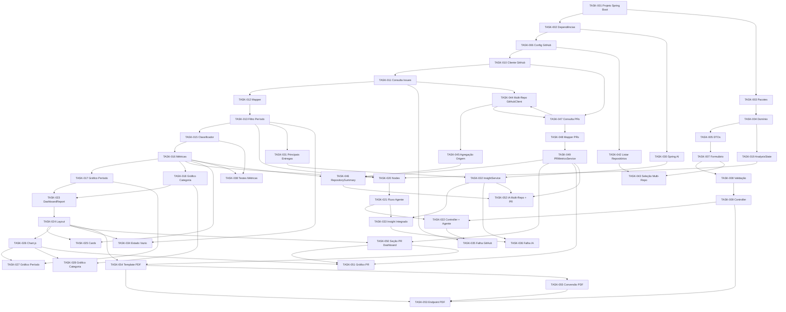

# Tasks

# DevReport

Versão: 1.0

Data: Julho/2026

Autor: Thiago Carlos Andrade

---

## 1. Objetivo

Este documento decompõe as Specifications do DevReport em Tasks executáveis para implementação do MVP.

As Tasks foram organizadas para permitir construção incremental, mantendo o sistema em estado funcional ao final de cada bloco relevante.

---

## 2. Convenções

| Campo | Descrição |
|---|---|
| ID | Identificador único da task |
| Prioridade | P0, P1 ou P2 |
| Specification | Specification principal relacionada |
| Dependências | Tasks que devem ser concluídas antes |
| Resultado esperado | Entrega concreta da task |
| Verificação | Como validar a conclusão |

---

## 3. Resumo das Tasks

### Arquitetura e Configuração

| ID | Task | Prioridade | SPEC |
|---|---|---|---|
| TASK-001 | Criar projeto Spring Boot com Maven | P0 | SPEC-001 |
| TASK-002 | Configurar dependências principais | P0 | SPEC-001 |
| TASK-003 | Criar estrutura de pacotes | P0 | SPEC-001 |
| TASK-004 | Criar modelos de domínio | P0 | SPEC-001 |
| TASK-005 | Criar DTOs principais | P0 | SPEC-001 |
| TASK-006 | Configurar propriedades do GitHub | P0 | SPEC-002 |

### Entrada e Validação

| ID | Task | Prioridade | SPEC |
|---|---|---|---|
| TASK-007 | Criar tela/formulário de período | P0 | SPEC-002 |
| TASK-008 | Validar entrada de período | P0 | SPEC-002 |
| TASK-009 | Criar controller do dashboard | P0 | SPEC-002 |

### Integração GitHub (Issues)

| ID | Task | Prioridade | SPEC |
|---|---|---|---|
| TASK-010 | Implementar cliente HTTP do GitHub | P0 | SPEC-003 |
| TASK-011 | Implementar consulta de issues concluídas | P0 | SPEC-003 |
| TASK-012 | Implementar mapper de GitHub para domínio | P0 | SPEC-003 |
| TASK-013 | Implementar filtro por período | P0 | SPEC-003 |
| TASK-014 | Tratar erros básicos da integração GitHub | P1 | SPEC-003 |

### Métricas de Issues

| ID | Task | Prioridade | SPEC |
|---|---|---|---|
| TASK-015 | Implementar classificador de issues | P0 | SPEC-004 |
| TASK-016 | Implementar cálculo de métricas consolidadas | P0 | SPEC-004 |
| TASK-017 | Implementar dados de gráfico por período | P0 | SPEC-004 |
| TASK-018 | Implementar dados de gráfico por categoria | P0 | SPEC-004 |

### Orquestração com LangGraph4j

| ID | Task | Prioridade | SPEC |
|---|---|---|---|
| TASK-019 | Criar estado AnalysisState | P0 | SPEC-005 |
| TASK-020 | Implementar nodes do LangGraph4j | P0 | SPEC-005 |
| TASK-021 | Montar fluxo principal do agente | P0 | SPEC-005 |
| TASK-022 | Integrar controller com agente | P0 | SPEC-005 |

### Dashboard Web

| ID | Task | Prioridade | SPEC |
|---|---|---|---|
| TASK-023 | Criar serviço de montagem do DashboardReport | P0 | SPEC-006 |
| TASK-024 | Criar layout base Thymeleaf | P0 | SPEC-006 |
| TASK-025 | Implementar cards de métricas | P0 | SPEC-006 |
| TASK-026 | Integrar Chart.js | P0 | SPEC-006 |
| TASK-027 | Renderizar gráfico de entregas por período | P0 | SPEC-006 |
| TASK-028 | Renderizar gráfico de distribuição por categoria | P0 | SPEC-006 |
| TASK-029 | Implementar área de resumo inteligente | P1 | SPEC-006 |

### Inteligência Artificial

| ID | Task | Prioridade | SPEC |
|---|---|---|---|
| TASK-030 | Configurar Spring AI/OpenAI | P1 | SPEC-007 |
| TASK-031 | Implementar seleção de principais entregas | P1 | SPEC-007 |
| TASK-032 | Implementar prompt e InsightService | P1 | SPEC-007 |
| TASK-033 | Integrar insight ao fluxo e dashboard | P1 | SPEC-007 |

### Tratamento de Erros e Logging

| ID | Task | Prioridade | SPEC |
|---|---|---|---|
| TASK-034 | Implementar estado sem entregas | P1 | SPEC-008 |
| TASK-035 | Implementar tratamento de falha GitHub | P1 | SPEC-008 |
| TASK-036 | Implementar tratamento de falha IA | P1 | SPEC-008 |
| TASK-037 | Implementar logging do fluxo principal | P1 | SPEC-008 |

### Testes do MVP

| ID | Task | Prioridade | SPEC |
|---|---|---|---|
| TASK-038 | Criar testes unitários de métricas | P1 | SPEC-009 |
| TASK-039 | Criar testes de mapper e classificação | P1 | SPEC-009 |
| TASK-040 | Criar testes de dashboard e insight | P1 | SPEC-009 |
| TASK-041 | Criar teste de integração do fluxo principal | P2 | SPEC-009 |

### Multi-Repo Support

| ID | Task | Prioridade | SPEC |
|---|---|---|---|
| TASK-042 | Implementar endpoint de listagem de repositórios | P0 | SPEC-010 |
| TASK-043 | Implementar seleção multi-repo no formulário | P0 | SPEC-010 |
| TASK-044 | Adaptar GitHubClient para multi-repo | P0 | SPEC-010 |
| TASK-045 | Implementar agregação e identificação de origem | P1 | SPEC-010 |
| TASK-046 | Implementar cálculo de RepositorySummary | P1 | SPEC-010 |

### PR Analytics

| ID | Task | Prioridade | SPEC |
|---|---|---|---|
| TASK-047 | Implementar consulta de PRs merged | P1 | SPEC-011 |
| TASK-048 | Implementar mapper de PRs | P1 | SPEC-011 |
| TASK-049 | Implementar PRMetricsService | P1 | SPEC-011 |
| TASK-050 | Implementar seção PR Analytics no dashboard | P1 | SPEC-011 |
| TASK-051 | Implementar gráfico de distribuição de PRs | P1 | SPEC-011 |
| TASK-052 | Atualizar InsightService com contexto multi-repo e PR | P1 | SPEC-011/010 |

### Exportação PDF

| ID | Task | Prioridade | SPEC |
|---|---|---|---|
| TASK-053 | Implementar endpoint de exportação PDF | P1 | SPEC-012 |
| TASK-054 | Criar template Thymeleaf otimizado para PDF | P1 | SPEC-012 |
| TASK-055 | Implementar conversão HTML para PDF | P1 | SPEC-012 |

### Testes das Novas Features

| ID | Task | Prioridade | SPEC |
|---|---|---|---|
| TASK-056 | Implementar teste de falha em um repositório | P1 | SPEC-010 |
| TASK-057 | Criar testes para PRMetricsService | P1 | SPEC-011 |
| TASK-058 | Criar teste de integração do fluxo completo | P2 | SPEC-009/010/011/012 |

### Correções Finais e Polimento

| ID | Task | Prioridade | SPEC |
|---|---|---|---|
| TASK-059 | Correções finais de encoding, modo mock IA e polimento do MVP | P1 | SPEC-008 |
| TASK-060 | Implementar README com explicação | P1 | SPEC-008 |

---

## 4. Tasks Detalhadas

### TASK-001 - Criar projeto Spring Boot com Maven

**Prioridade:** P0

**Specification:** SPEC-001

**Descrição:** Criar ou ajustar a base do projeto Spring Boot usando Java 21 e Maven.

**Resultado esperado:** Aplicação Spring Boot inicial compilável.

**Dependências:** Nenhuma.

**Verificação:**

- O projeto possui `pom.xml`.
- A aplicação possui classe principal Spring Boot.
- O build Maven executa sem erro.

---

### TASK-002 - Configurar dependências principais

**Prioridade:** P0

**Specification:** SPEC-001

**Descrição:** Adicionar dependências necessárias para Spring Web, Thymeleaf, validação, Spring AI, LangGraph4j, cliente HTTP, testes e suporte ao frontend.

**Resultado esperado:** Dependências essenciais disponíveis no build.

**Dependências:** TASK-001.

**Verificação:**

- Maven resolve dependências.
- A aplicação inicia sem erro de classe ausente.
- Dependências de teste estão disponíveis.

---

### TASK-003 - Criar estrutura de pacotes

**Prioridade:** P0

**Specification:** SPEC-001

**Descrição:** Criar pacotes `config`, `controller`, `application`, `domain`, `infrastructure`, `github`, `metrics`, `dashboard`, `ai`, `agent` e `shared`.

**Resultado esperado:** Estrutura de pacotes alinhada ao TDD.

**Dependências:** TASK-001.

**Verificação:**

- Pacotes existem em `src/main/java/br/com/devreport`.
- Responsabilidades de código seguem a separação planejada.

---

### TASK-004 - Criar modelos de domínio

**Prioridade:** P0

**Specification:** SPEC-001

**Descrição:** Criar `AnalysisRequest`, `Issue`, `Metric`, `DashboardReport`, `Insight` e modelos auxiliares para dados de gráficos.

**Resultado esperado:** Domínio mínimo para representar análise, entregas, métricas, insight e relatório.

**Dependências:** TASK-003.

**Verificação:**

- Modelos possuem campos mínimos definidos nas Specifications.
- Modelos de domínio não dependem de Spring.
- Código compila.

---

### TASK-005 - Criar DTOs principais

**Prioridade:** P0

**Specification:** SPEC-001

**Descrição:** Criar `AnalysisRequestDTO`, `IssueDTO`, `MetricDTO`, `DashboardDTO` e `InsightDTO`.

**Resultado esperado:** Contratos de entrada e saída para controller/view.

**Dependências:** TASK-004.

**Verificação:**

- DTOs existem e representam os dados necessários.
- DTOs não substituem regras de domínio.

---

### TASK-006 - Configurar propriedades do GitHub

**Prioridade:** P0

**Specification:** SPEC-002

**Descrição:** Criar propriedades para token, owner, repository e project em `application.yml` ou configuração equivalente.

**Resultado esperado:** Configuração GitHub carregável pela aplicação.

**Dependências:** TASK-002.

**Verificação:**

- Propriedades são lidas por classe de configuração.
- Token não é impresso em logs.
- Configuração inválida gera erro controlável.

---

### TASK-007 - Criar tela/formulário de período

**Prioridade:** P0

**Specification:** SPEC-002

**Descrição:** Criar view Thymeleaf inicial com campos `startDate` e `endDate`.

**Resultado esperado:** Usuário consegue informar período para análise.

**Dependências:** TASK-002, TASK-005.

**Verificação:**

- Tela renderiza no navegador.
- Campos de data estão presentes.
- Formulário envia dados ao backend.

---

### TASK-008 - Validar entrada de período

**Prioridade:** P0

**Specification:** SPEC-002

**Descrição:** Validar campos obrigatórios e impedir data final anterior à inicial.

**Resultado esperado:** Entrada inválida não inicia análise.

**Dependências:** TASK-007.

**Verificação:**

- Datas ausentes exibem validação.
- Data final anterior à inicial exibe validação.
- Período válido segue para análise.

---

### TASK-009 - Criar controller do dashboard

**Prioridade:** P0

**Specification:** SPEC-002

**Descrição:** Criar `DashboardController` para exibir tela inicial e receber solicitação de análise.

**Resultado esperado:** Controller conecta formulário ao caso de uso/fluxo de análise.

**Dependências:** TASK-005, TASK-007, TASK-008.

**Verificação:**

- `GET` renderiza dashboard inicial.
- `POST` recebe período informado.
- Controller não contém regra de negócio.

---

### TASK-010 - Implementar cliente HTTP do GitHub

**Prioridade:** P0

**Specification:** SPEC-003

**Descrição:** Criar componente de infraestrutura para chamadas à GitHub REST API usando token configurado.

**Resultado esperado:** Cliente capaz de realizar requisições autenticadas ao GitHub.

**Dependências:** TASK-006.

**Verificação:**

- Cabeçalho de autenticação é enviado.
- URL base e parâmetros usam configuração.
- Token não aparece em logs.

---

### TASK-011 - Implementar consulta de issues concluídas

**Prioridade:** P0

**Specification:** SPEC-003

**Descrição:** Implementar serviço para buscar issues concluídas do repositório/projeto configurado.

**Resultado esperado:** Lista bruta de issues concluídas recuperada da API.

**Dependências:** TASK-010.

**Verificação:**

- Consulta retorna issues fechadas.
- Issues abertas não são consideradas.
- Falha HTTP é capturada para tratamento posterior.

---

### TASK-012 - Implementar mapper de GitHub para domínio

**Prioridade:** P0

**Specification:** SPEC-003

**Descrição:** Converter resposta da API GitHub para o modelo `Issue` do domínio.

**Resultado esperado:** Dados externos normalizados para uso interno.

**Dependências:** TASK-004, TASK-011.

**Verificação:**

- Campos obrigatórios são mapeados.
- Campos opcionais ausentes não quebram conversão.
- Labels são preservadas para classificação.

---

### TASK-013 - Implementar filtro por período

**Prioridade:** P0

**Specification:** SPEC-003

**Descrição:** Filtrar issues por `closedAt` dentro de `startDate` e `endDate`.

**Resultado esperado:** Apenas entregas do período informado seguem para análise.

**Dependências:** TASK-008, TASK-012.

**Verificação:**

- Issues antes do período são removidas.
- Issues depois do período são removidas.
- Issues sem `closedAt` são removidas.

---

### TASK-014 - Tratar erros básicos da integração GitHub

**Prioridade:** P1

**Specification:** SPEC-003

**Descrição:** Padronizar erros de autenticação, indisponibilidade e falhas de comunicação com GitHub.

**Resultado esperado:** Erros externos viram respostas tratáveis pelo fluxo principal.

**Dependências:** TASK-011.

**Verificação:**

- Erro 401/403 não expõe token.
- Erro de rede gera exceção ou resultado controlado.
- Mensagem final é amigável.

---

### TASK-015 - Implementar classificador de issues

**Prioridade:** P0

**Specification:** SPEC-004

**Descrição:** Classificar cada issue como Feature, Bug ou Task a partir de labels, com fallback para Task.

**Resultado esperado:** Cada issue possui uma categoria única.

**Dependências:** TASK-012, TASK-013.

**Verificação:**

- Label feature classifica como Feature.
- Label bug classifica como Bug.
- Label task classifica como Task.
- Label desconhecida ou ausente classifica como Task.

---

### TASK-016 - Implementar cálculo de métricas consolidadas

**Prioridade:** P0

**Specification:** SPEC-004

**Descrição:** Calcular total, features, bugs e tasks a partir da lista classificada.

**Resultado esperado:** `Metric` preenchida corretamente.

**Dependências:** TASK-015.

**Verificação:**

- Total corresponde à quantidade de issues filtradas.
- Soma das categorias equivale ao total.
- Lista vazia retorna zeros.

---

### TASK-017 - Implementar dados de gráfico por período

**Prioridade:** P0

**Specification:** SPEC-004

**Descrição:** Agregar entregas por período para consumo pelo Chart.js.

**Resultado esperado:** Estrutura com labels e valores por período.

**Dependências:** TASK-016.

**Verificação:**

- Issues são agrupadas por data ou período definido.
- Saída é serializável para a view.
- Lista vazia retorna estrutura vazia.

---

### TASK-018 - Implementar dados de gráfico por categoria

**Prioridade:** P0

**Specification:** SPEC-004

**Descrição:** Criar estrutura de dados para gráfico de distribuição por Feature, Bug e Task.

**Resultado esperado:** Dados de categoria prontos para Chart.js.

**Dependências:** TASK-016.

**Verificação:**

- Saída contém Feature, Bug e Task.
- Valores batem com `Metric`.
- Lista vazia retorna zeros.

---

### TASK-019 - Criar estado AnalysisState

**Prioridade:** P0

**Specification:** SPEC-005

**Descrição:** Criar estado compartilhado do agente com datas, issues, métricas, resumo, dashboard e erros.

**Resultado esperado:** `AnalysisState` usado pelos nodes do fluxo.

**Dependências:** TASK-004.

**Verificação:**

- Estado possui campos definidos na SPEC-005.
- Estado permite leitura e atualização pelos nodes.

---

### TASK-020 - Implementar nodes do LangGraph4j

**Prioridade:** P0

**Specification:** SPEC-005

**Descrição:** Implementar `StartNode`, `ValidateRequestNode`, `FetchGitHubDataNode`, `CalculateMetricsNode`, `GenerateInsightsNode` e `BuildDashboardNode`.

**Resultado esperado:** Nodes isolados por responsabilidade.

**Dependências:** TASK-013, TASK-016, TASK-019.

**Verificação:**

- Cada node executa apenas sua responsabilidade.
- Nodes atualizam `AnalysisState`.
- Validação impede consulta GitHub em entrada inválida.

---

### TASK-021 - Montar fluxo principal do agente

**Prioridade:** P0

**Specification:** SPEC-005

**Descrição:** Conectar nodes no fluxo LangGraph4j na ordem definida pela Specification.

**Resultado esperado:** Agente executa análise de ponta a ponta.

**Dependências:** TASK-020.

**Verificação:**

- Ordem do fluxo é validação, GitHub, métricas, IA e dashboard.
- Métricas são calculadas antes da IA.
- Erro de IA não bloqueia dashboard.

---

### TASK-022 - Integrar controller com agente

**Prioridade:** P0

**Specification:** SPEC-005

**Descrição:** Fazer `DashboardController` acionar o agente e receber `DashboardReport`.

**Resultado esperado:** Formulário dispara fluxo real da aplicação.

**Dependências:** TASK-009, TASK-021.

**Verificação:**

- Solicitação válida aciona agente.
- Resultado é enviado para a view.
- Erros são enviados para apresentação amigável.

---

### TASK-023 - Criar serviço de montagem do DashboardReport

**Prioridade:** P0

**Specification:** SPEC-006

**Descrição:** Implementar `DashboardService` para consolidar métricas, gráficos, resumo e mensagens.

**Resultado esperado:** Relatório final unificado para a view.

**Dependências:** TASK-017, TASK-018, TASK-019.

**Verificação:**

- `DashboardReport` contém métricas.
- `DashboardReport` contém dados de gráficos.
- `DashboardReport` aceita resumo opcional.

---

### TASK-024 - Criar layout base Thymeleaf

**Prioridade:** P0

**Specification:** SPEC-006

**Descrição:** Criar template base do dashboard com Bootstrap 5.

**Resultado esperado:** Tela web estruturada e responsiva.

**Dependências:** TASK-007, TASK-023.

**Verificação:**

- Template renderiza sem erro.
- Layout mantém formulário e área de relatório.
- Interface é utilizável em desktop.

---

### TASK-025 - Implementar cards de métricas

**Prioridade:** P0

**Specification:** SPEC-006

**Descrição:** Exibir cards de Total de Entregas, Features, Bugs e Tasks.

**Resultado esperado:** Usuário visualiza indicadores principais.

**Dependências:** TASK-016, TASK-024.

**Verificação:**

- Cards exibem valores do backend.
- Valores zerados são exibidos corretamente.
- Layout não quebra em telas menores.

---

### TASK-026 - Integrar Chart.js

**Prioridade:** P0

**Specification:** SPEC-006

**Descrição:** Adicionar Chart.js ao template e preparar scripts para renderização.

**Resultado esperado:** Dashboard pronto para renderizar gráficos.

**Dependências:** TASK-024.

**Verificação:**

- Chart.js carrega na tela.
- Scripts não geram erro no navegador.
- Dados podem ser injetados pela view.

---

### TASK-027 - Renderizar gráfico de entregas por período

**Prioridade:** P0

**Specification:** SPEC-006

**Descrição:** Exibir gráfico de entregas por período com dados calculados pelo backend.

**Resultado esperado:** Gráfico temporal visível no dashboard.

**Dependências:** TASK-017, TASK-026.

**Verificação:**

- Gráfico usa labels e valores reais.
- Cenário sem dados não quebra renderização.
- Gráfico é legível no layout.

---

### TASK-028 - Renderizar gráfico de distribuição por categoria

**Prioridade:** P0

**Specification:** SPEC-006

**Descrição:** Exibir gráfico de distribuição por Feature, Bug e Task.

**Resultado esperado:** Gráfico de categorias visível no dashboard.

**Dependências:** TASK-018, TASK-026.

**Verificação:**

- Gráfico usa dados reais de categoria.
- Valores batem com cards.
- Cenário sem dados não quebra renderização.

---

### TASK-029 - Implementar área de resumo inteligente

**Prioridade:** P1

**Specification:** SPEC-006

**Descrição:** Criar área no dashboard para exibir insight gerado por IA ou mensagem de ausência controlada.

**Resultado esperado:** Resumo aparece junto aos indicadores quando disponível.

**Dependências:** TASK-024.

**Verificação:**

- Texto de resumo é exibido quando presente.
- Ausência de resumo não quebra layout.
- Mensagem de ausência é amigável.

---

### TASK-030 - Configurar Spring AI/OpenAI

**Prioridade:** P1

**Specification:** SPEC-007

**Descrição:** Configurar dependências, propriedades e client do Spring AI para chamada ao modelo OpenAI GPT.

**Resultado esperado:** Infraestrutura de IA pronta para uso pelo `InsightService`.

**Dependências:** TASK-002.

**Verificação:**

- Propriedades de IA são carregadas.
- Credenciais não são expostas em logs.
- Serviço pode ser simulado em testes.

---

### TASK-031 - Implementar seleção de principais entregas

**Prioridade:** P1

**Specification:** SPEC-007

**Descrição:** Selecionar subconjunto representativo de issues para alimentar o prompt.

**Resultado esperado:** Lista limitada de entregas relevantes para IA.

**Dependências:** TASK-013, TASK-016.

**Verificação:**

- Seleção inclui título, descrição e categoria quando disponíveis.
- Quantidade enviada ao prompt é limitada.
- Lista vazia é tratada.

---

### TASK-032 - Implementar prompt e InsightService

**Prioridade:** P1

**Specification:** SPEC-007

**Descrição:** Criar `InsightService` com prompt baseado em métricas e principais entregas.

**Resultado esperado:** Serviço retorna `Insight` com resumo executivo.

**Dependências:** TASK-030, TASK-031.

**Verificação:**

- Prompt contém total, categorias e entregas.
- Resumo é retornado quando IA responde.
- Erro da IA é capturado.

---

### TASK-033 - Integrar insight ao fluxo e dashboard

**Prioridade:** P1

**Specification:** SPEC-007

**Descrição:** Conectar `InsightService` ao `GenerateInsightsNode` e exibir resultado no dashboard.

**Resultado esperado:** IA participa do fluxo sem bloquear métricas.

**Dependências:** TASK-021, TASK-029, TASK-032.

**Verificação:**

- Insight é gerado após métricas.
- Dashboard exibe o resumo.
- Falha de IA mantém cards e gráficos.

---

### TASK-034 - Implementar estado sem entregas

**Prioridade:** P1

**Specification:** SPEC-008

**Descrição:** Exibir estado vazio quando não houver issues concluídas no período.

**Resultado esperado:** Usuário entende que a consulta funcionou, mas não encontrou entregas.

**Dependências:** TASK-013, TASK-023, TASK-024.

**Verificação:**

- Mensagem de ausência de entregas aparece.
- Cards e gráficos não quebram.
- Estado vazio é distinto de erro GitHub.

---

### TASK-035 - Implementar tratamento de falha GitHub

**Prioridade:** P1

**Specification:** SPEC-008

**Descrição:** Exibir mensagem amigável quando GitHub estiver indisponível, token inválido ou configuração incorreta.

**Resultado esperado:** Falhas GitHub não expõem detalhes sensíveis.

**Dependências:** TASK-014, TASK-022, TASK-024.

**Verificação:**

- Mensagem amigável é exibida.
- Token não aparece na resposta.
- Dashboard permanece acessível.

---

### TASK-036 - Implementar tratamento de falha IA

**Prioridade:** P1

**Specification:** SPEC-008

**Descrição:** Tornar erro da IA não bloqueante e exibir dashboard com métricas.

**Resultado esperado:** Dashboard funciona mesmo sem resumo inteligente.

**Dependências:** TASK-032, TASK-033.

**Verificação:**

- Erro de IA não interrompe fluxo.
- Cards e gráficos continuam visíveis.
- Mensagem de resumo indisponível é exibida quando aplicável.

---

### TASK-037 - Implementar logging do fluxo principal

**Prioridade:** P1

**Specification:** SPEC-008

**Descrição:** Registrar início/fim da análise, consulta GitHub, cálculo de métricas, IA e tempo total.

**Resultado esperado:** Logs úteis para diagnóstico do MVP.

**Dependências:** TASK-021, TASK-033, TASK-035.

**Verificação:**

- Logs cobrem os principais passos.
- Tempo de processamento é registrado.
- Logs não expõem token ou segredos.

---

### TASK-038 - Criar testes unitários de métricas

**Prioridade:** P1

**Specification:** SPEC-009

**Descrição:** Testar totalização, categorias, lista vazia e consistência da soma.

**Resultado esperado:** Motor de métricas validado.

**Dependências:** TASK-015, TASK-016.

**Verificação:**

- Testes cobrem Feature, Bug e Task.
- Teste cobre fallback para Task.
- Testes passam localmente.

---

### TASK-039 - Criar testes de mapper e classificação

**Prioridade:** P1

**Specification:** SPEC-009

**Descrição:** Testar conversão de dados GitHub para domínio e categorização.

**Resultado esperado:** Entrada externa validada antes de alimentar métricas.

**Dependências:** TASK-012, TASK-015.

**Verificação:**

- Campos obrigatórios são mapeados.
- Campos opcionais ausentes são aceitos.
- Classificação por labels é consistente.

---

### TASK-040 - Criar testes de dashboard e insight

**Prioridade:** P1

**Specification:** SPEC-009

**Descrição:** Testar montagem do `DashboardReport` e comportamento do `InsightService` com sucesso e falha.

**Resultado esperado:** Relatório e IA possuem cobertura mínima.

**Dependências:** TASK-023, TASK-032, TASK-036.

**Verificação:**

- Dashboard report contém métricas e gráficos.
- Resumo opcional é tratado.
- Falha da IA é coberta por teste.

---

### TASK-041 - Criar teste de integração do fluxo principal

**Prioridade:** P2

**Specification:** SPEC-009

**Descrição:** Criar teste do fluxo principal com GitHub e IA simulados.

**Resultado esperado:** Validação de ponta a ponta sem dependências externas reais.

**Dependências:** TASK-021, TASK-033, TASK-035, TASK-036.

**Verificação:**

- Período válido com issues simuladas retorna dashboard.
- Fluxo sem dados retorna estado vazio.
- Falha de IA mantém métricas.
- Falha de GitHub retorna erro amigável.

---

### TASK-042 - Implementar endpoint de listagem de repositórios

**Prioridade:** P0

**Specification:** SPEC-010

**Descrição:** Criar endpoint `GET /api/repositories` no GitHubClient para listar repositórios do owner configurado via GitHub REST API.

**Resultado esperado:** Frontend pode popular campo de seleção de repositórios.

**Dependências:** TASK-010.

**Verificação:**

- Endpoint retorna lista de repositórios disponíveis.
- A listagem respeita o token configurado.
- A resposta é serializável para consumo pelo frontend.

---

### TASK-043 - Implementar seleção multi-repo no formulário

**Prioridade:** P0

**Specification:** SPEC-010

**Descrição:** Adicionar campo multi-select ou checkboxes no formulário Thymeleaf, populado dinamicamente via endpoint de listagem de repositórios.

**Resultado esperado:** Usuário pode selecionar um ou mais repositórios antes de gerar o relatório.

**Dependências:** TASK-007, TASK-042.

**Verificação:**

- Formulário exibe lista de repositórios disponíveis.
- Usuário pode selecionar múltiplos.
- Repositórios selecionados são enviados ao backend.
- Se nenhum for selecionado, usar repositório padrão.

---

### TASK-044 - Adaptar GitHubClient para multi-repo

**Prioridade:** P0

**Specification:** SPEC-010

**Descrição:** Modificar GitHubClient para aceitar lista de repositórios e iterar sobre cada um nas consultas de issues e PRs.

**Resultado esperado:** Cliente coleta dados de N repositórios em uma única análise.

**Dependências:** TASK-011, TASK-047.

**Verificação:**

- Cliente aceita lista de repositórios.
- Para cada repositório, issues e PRs são coletados.
- Cada item recebe o identificador do repositório de origem.
- Falha em um repositório não interrompe os demais.

---

### TASK-045 - Implementar agregação e identificação de origem

**Prioridade:** P1

**Specification:** SPEC-010

**Descrição:** Garantir que cada Issue e PullRequest contenha o campo `repository` (owner/repo) identificando sua origem, e que as listas sejam agregadas corretamente.

**Resultado esperado:** Dados de múltiplos repositórios são unificados com rastreabilidade de origem.

**Dependências:** TASK-044.

**Verificação:**

- Toda Issue possui `repository` preenchido.
- Todo PullRequest possui `repository` preenchido.
- Listas agregadas mantêm a ordem de coleta.
- É possível filtrar por repositório após agregação.

---

### TASK-046 - Implementar cálculo de RepositorySummary

**Prioridade:** P1

**Specification:** SPEC-010

**Descrição:** Calcular indicadores por repositório: total de issues, total de PRs e total de additions.

**Resultado esperado:** Dashboard pode exibir tabela/resumo por repositório.

**Dependências:** TASK-016, TASK-045, TASK-049.

**Verificação:**

- RepositorySummary é calculado para cada repositório.
- Totais por repositório são consistentes com o agregado.
- Lista vazia retorna summaries vazios.

---

### TASK-047 - Implementar consulta de PRs merged

**Prioridade:** P1

**Specification:** SPEC-011

**Descrição:** Implementar consulta à GitHub REST API para recuperar PRs merged do período, incluindo additions, deletions, changedFiles, revisores e comentários.

**Resultado esperado:** Lista de PRs merged disponível para métricas.

**Dependências:** TASK-010, TASK-044.

**Verificação:**

- Apenas PRs merged são retornados.
- PRs fora do período não são incluídos.
- Dados de additions, deletions, changedFiles e revisores são coletados.
- Falha na consulta é capturada para tratamento.

---

### TASK-048 - Implementar mapper de PRs

**Prioridade:** P1

**Specification:** SPEC-011

**Descrição:** Criar mapper para converter resposta da API GitHub de PRs para o modelo `PullRequest` do domínio.

**Resultado esperado:** Dados de PR normalizados para uso interno.

**Dependências:** TASK-047.

**Verificação:**

- Campos obrigatórios são mapeados.
- Lista de revisores é extraída corretamente.
- Campos opcionais ausentes não quebram conversão.

---

### TASK-049 - Implementar PRMetricsService

**Prioridade:** P1

**Specification:** SPEC-011

**Descrição:** Implementar serviço para calcular totalMerged, additions, deletions, changedFiles, averageTimeToMerge, uniqueReviewers e prSizeDistribution.

**Resultado esperado:** PRMetrics disponível para o dashboard.

**Dependências:** TASK-048.

**Verificação:**

- totalMerged reflete quantidade de PRs.
- Linhas alteradas = additions + deletions.
- Tempo até merge é calculado em horas.
- Revisores distintos são contados.
- Distribuição small/medium/large é calculada.
- Lista vazia retorna métricas zeradas.

---

### TASK-050 - Implementar seção PR Analytics no dashboard

**Prioridade:** P1

**Specification:** SPEC-011

**Descrição:** Adicionar seção "PR Analytics" no dashboard Thymeleaf com cards de PRs merged, linhas alteradas, tempo até merge e revisores.

**Resultado esperado:** Usuário visualiza métricas de PR no dashboard.

**Dependências:** TASK-024, TASK-049.

**Verificação:**

- Cards de PR aparecem no dashboard.
- Valores refletem métricas calculadas.
- Seção fica visível apenas quando há dados de PR.
- Layout não quebra com ou sem PRs.

---

### TASK-051 - Implementar gráfico de distribuição de PRs

**Prioridade:** P1

**Specification:** SPEC-011

**Descrição:** Adicionar gráfico Chart.js de distribuição por tamanho de PR (pequeno/médio/grande).

**Resultado esperado:** Gráfico de PR visível no dashboard.

**Dependências:** TASK-026, TASK-049, TASK-050.

**Verificação:**

- Gráfico usa dados de distribuição de PR.
- Valores batem com os cards.
- Cenário sem dados não quebra renderização.

---

### TASK-052 - Atualizar InsightService com contexto multi-repo e PR

**Prioridade:** P1

**Specification:** SPEC-011, SPEC-010

**Descrição:** Modificar o prompt da IA para incluir métricas de PR (merged, linhas, tempo) e contexto multi-repo (quantidade de repositórios, destaques individuais).

**Resultado esperado:** Resumo da IA menciona dados de PR e múltiplos repositórios.

**Dependências:** TASK-032, TASK-046, TASK-049.

**Verificação:**

- Prompt inclui PRMetrics e RepositorySummary.
- Resumo menciona quantidade de repositórios.
- Resumo pode destacar repositório com maior contribuição.
- Falha da IA não quebra dashboard com PRs.

---

### TASK-053 - Implementar endpoint de exportação PDF

**Prioridade:** P1

**Specification:** SPEC-012

**Descrição:** Criar endpoint `GET /dashboard/export` que aceita período e repositórios, reutiliza o fluxo de análise e retorna PDF.

**Resultado esperado:** Usuário pode baixar relatório em PDF.

**Dependências:** TASK-009, TASK-054, TASK-055.

**Verificação:**

- Endpoint aceita mesmos parâmetros do dashboard.
- Resposta tem Content-Type `application/pdf`.
- Download é disparado no navegador.
- PDF contém dados corretos do período.

---

### TASK-054 - Criar template Thymeleaf otimizado para PDF

**Prioridade:** P1

**Specification:** SPEC-012

**Descrição:** Criar template específico para PDF com CSS `@media print`, dimensões A4, gráficos SVG inline, cabeçalho com período/repositórios, cards KPI e resumo IA.

**Resultado esperado:** Template renderiza HTML próprio para conversão em PDF.

**Dependências:** TASK-024, TASK-050.

**Verificação:**

- Template possui CSS `@media print`.
- Dimensões seguem A4.
- Gráficos são SVG inline.
- Elementos interativos são ocultados.
- Layout não quebra entre páginas.

---

### TASK-055 - Implementar conversão HTML para PDF

**Prioridade:** P1

**Specification:** SPEC-012

**Descrição:** Implementar serviço que renderiza template Thymeleaf e converte para PDF usando Flying Saucer (ou biblioteca equivalente).

**Resultado esperado:** HTML é convertido em PDF válido.

**Dependências:** TASK-054.

**Verificação:**

- HTML é renderizado com Thymeleaf.
- Conversão produz PDF sem erros.
- PDF pode ser aberto em leitores comuns.
- Acentos e caracteres especiais são preservados.

---

### TASK-056 - Implementar teste de falha em um repositório

**Prioridade:** P1

**Specification:** SPEC-010

**Descrição:** Testar que falha em um repositório durante coleta multi-repo não interrompe a análise dos demais.

**Resultado esperado:** Resiliência da consulta multi-repo validada.

**Dependências:** TASK-044.

**Verificação:**

- Um repositório simulado com falha não impede coleta dos outros.
- Log registra falha do repositório específico.
- Dashboard exibe mensagem sobre falha parcial.

---

### TASK-057 - Criar testes para PRMetricsService

**Prioridade:** P1

**Specification:** SPEC-011

**Descrição:** Testar cálculo de PR metrics: merged total, additions/deletions, tempo até merge, revisores e distribuição de tamanho.

**Resultado esperado:** PRMetricsService validado unitariamente.

**Dependências:** TASK-049.

**Verificação:**

- Teste cobre PRs com múltiplos revisores.
- Teste cobre PRs sem revisores.
- Teste cobre distribuição small/medium/large.
- Teste cobre lista vazia.
- Tempo até merge é calculado corretamente.

---

### TASK-058 - Criar teste de integração do fluxo completo

**Prioridade:** P2

**Specification:** SPEC-009, SPEC-010, SPEC-011, SPEC-012

**Descrição:** Criar teste de integração simulando múltiplos repositórios com issues e PRs, validando agregação, métricas de PR e exportação PDF.

**Resultado esperado:** Fluxo completo (multi-repo + issues + PRs + PDF) validado sem dependências externas.

**Dependências:** TASK-041, TASK-045, TASK-052, TASK-055.

**Verificação:**

- Múltiplos repositórios com issues e PRs retornam dashboard consolidado.
- RepositorySummary reflete cada repositório individualmente.
- Métricas de PR são consistentes.
- PDF é gerado sem erro.
- Falha em um repositório mantém análise dos demais.

---

### TASK-059 - Correções finais de encoding, modo mock IA e polimento do MVP

**Prioridade:** P1

**Specification:** SPEC-008

**Descrição:** Consolidar correções finais do MVP: remover BOM de arquivos Java, implementar modo mock no InsightService para funcionamento sem chave API OpenAI, consolidar dependências no pom.xml, refinar templates dashboard e PDF, e ajustar controller/DTOs.

**Resultado esperado:** Projeto compila e executa sem erros de encoding; IA funciona em modo mock sem depender de API externa; templates renderizam corretamente.

**Dependências:** TASK-032, TASK-036, TASK-055.

**Verificação:**

- Arquivos Java não possuem BOM.
- Projeto compila com `mvnw.cmd compile`.
- Modo mock da IA gera resumo fallback a partir das métricas.
- Templates dashboard e PDF renderizam sem erros.
- Dependências no pom.xml estão consolidadas.

---

### TASK-060 - Implementar README com explicação

**Prioridade:** P1

**Specification:** SPEC-008

**Descrição:** Criar e atualizar o README.md do projeto com explicação completa sobre o DevReport: objetivo, arquitetura, stack tecnológica, fluxo do agente LangGraph4j, instruções de execução, funcionalidades do dashboard, testes e estrutura do projeto.

**Resultado esperado:** README.md claro, completo e profissional, servindo como documentação de entrada para novos desenvolvedores e stakeholders.

**Dependências:** TASK-059.

**Verificação:**

- README.md contém seção "Sobre" com objetivo do projeto.
- README.md contém diagrama de arquitetura e estrutura de pacotes.
- README.md contém tabela da stack tecnológica.
- README.md documenta o fluxo do agente LangGraph4j com diagrama e descrição dos 6 nodes.
- README.md contém instruções de execução com variáveis de ambiente e comandos Maven.
- README.md lista as funcionalidades do dashboard (Issues, IA, PR Analytics, PDF).
- README.md contém seção de testes com tabela de cobertura.
- README.md inclui badges (Java 21, Spring Boot 3.3, licença MIT).

---

## 5. Sequência Recomendada

---

## 6. Recorte de Execução

### Fundação e GitHub

- TASK-001 a TASK-013
- TASK-042 - Listar repositórios disponíveis
- TASK-043 - Seleção multi-repo no formulário
- TASK-044 - Multi-repo no GitHubClient

### Métricas, Agente e Dashboard Principal

- TASK-015 a TASK-018
- TASK-019 a TASK-028
- TASK-045 - Agregação com identificação de origem
- TASK-047 - Consultar PRs merged
- TASK-048 - Mapper de PRs
- TASK-049 - PRMetricsService
- TASK-050 - Seção PR Analytics
- TASK-051 - Gráfico de PR

### IA e Exportação

- TASK-030 a TASK-033
- TASK-052 - IA com multi-repo e PR
- TASK-053 a TASK-055 - Exportação PDF
- TASK-046 - RepositorySummary

### Resiliência e Validação

- TASK-014, TASK-034 a TASK-037
- TASK-038 a TASK-041
- TASK-056 - Teste falha em repositório
- TASK-057 - Testes PRMetricsService
- TASK-058 - Teste integração completo (P2)

---

## 7. MVP Mínimo Demonstrável

O menor conjunto de tasks para uma demonstração de ponta a ponta é:

- TASK-001 a TASK-013
- TASK-015 a TASK-028
- TASK-030 a TASK-036
- TASK-042 a TASK-045
- TASK-047 a TASK-052
- TASK-053 a TASK-055

As tasks de teste (TASK-038 a TASK-041, TASK-056 a TASK-058) aumentam confiabilidade e devem ser priorizadas assim que o fluxo principal estiver funcionando.

---

## 8. Mapa de Rastreabilidade

| Specification | Tasks |
|---|---|
| SPEC-001 | TASK-001, TASK-002, TASK-003, TASK-004, TASK-005 |
| SPEC-002 | TASK-006, TASK-007, TASK-008, TASK-009 |
| SPEC-003 | TASK-010, TASK-011, TASK-012, TASK-013, TASK-014 |
| SPEC-004 | TASK-015, TASK-016, TASK-017, TASK-018 |
| SPEC-005 | TASK-019, TASK-020, TASK-021, TASK-022 |
| SPEC-006 | TASK-023, TASK-024, TASK-025, TASK-026, TASK-027, TASK-028, TASK-029 |
| SPEC-007 | TASK-030, TASK-031, TASK-032, TASK-033 |
| SPEC-008 | TASK-034, TASK-035, TASK-036, TASK-037 |
| SPEC-009 | TASK-038, TASK-039, TASK-040, TASK-041 |
| SPEC-010 | TASK-042, TASK-043, TASK-044, TASK-045, TASK-046 |
| SPEC-011 | TASK-047, TASK-048, TASK-049, TASK-050, TASK-051, TASK-052 |
| SPEC-012 | TASK-053, TASK-054, TASK-055 |
| SPEC-010, SPEC-011 | TASK-056 (falha repositório), TASK-057 (PRMetrics), TASK-058 (integração completo) |

---

## 9. Definition of Done das Tasks

Uma task será considerada concluída quando:

- o resultado esperado estiver implementado;
- a verificação descrita na task puder ser executada;
- o código compilar;
- a task não quebrar o fluxo já implementado;
- regras de negócio permanecerem fora de controllers e integrações;
- credenciais não forem expostas em logs, mensagens ou templates;
- testes forem adicionados quando a task exigir validação de regra.

